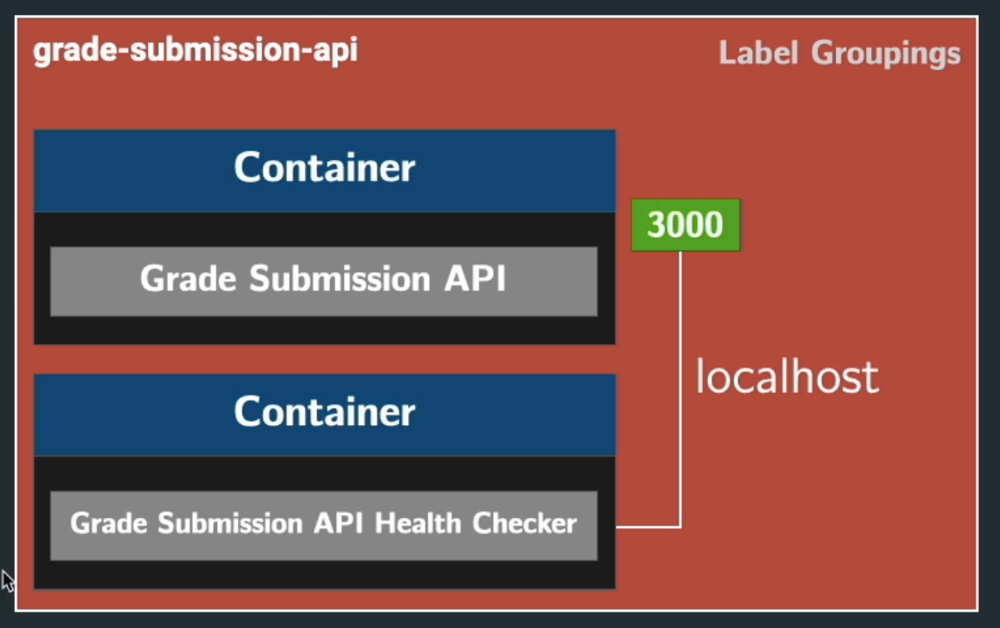
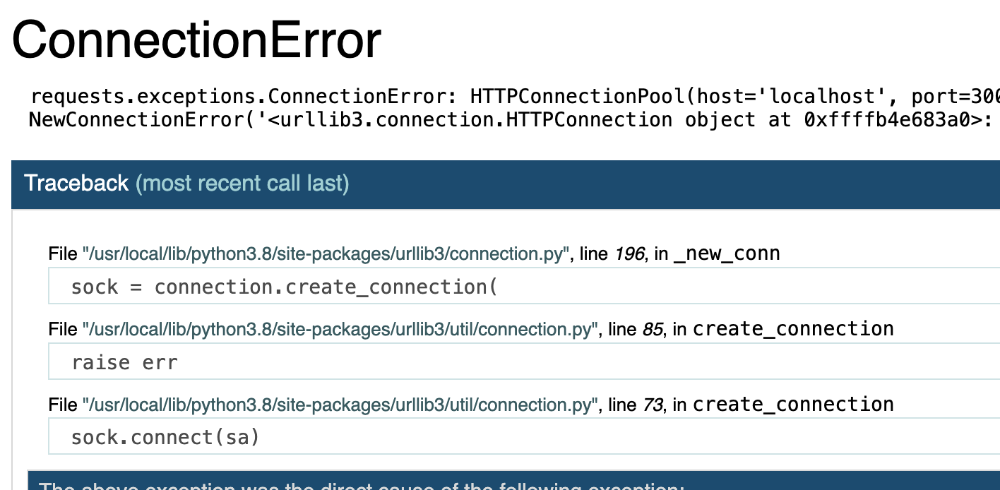
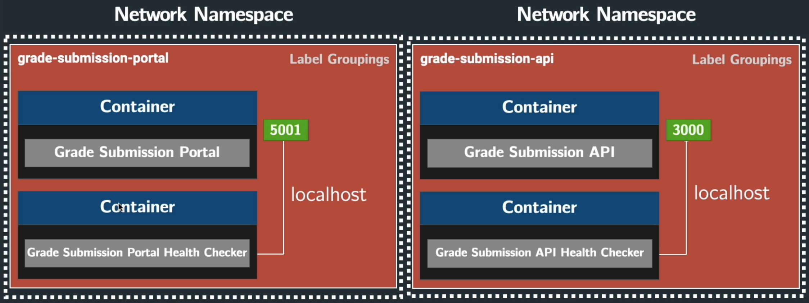

# k8s basic 04 - Additional Practices
#dev/skill/container/k8s

## 강의
[온라인 강의 - 자신의 일정에 맞춰 뭐든지 배워보세요](https://www.udemy.com/course/kubernetes-training-learn-kubernetes-from-zero-to-cloud/learn/lecture/44369094#overview)

## 스크립트 요약
(지난 학습과 동일한 내용이 반복되므로 생략)

## 실습
자 앞선 학습에서 `grade-submission-poratl` 애플리케이션을 `pod`로 실행해봤다. 이번에는 그 `api` 서비스인 `grade-submission-api` 애플리케이션을 pod로 실행하자. `api` 역시 `Health Checker` 컨테이너가 존재하는 `sidecar` 패턴으로 구축한다.


>참고로 해당 작업에 필요한 모든 이미지는 강사가 제공한 docker hub에서 내려받아 진행 중이다.


### pod.yaml 작성
> /section-one/grade-submission-api-pod.yaml
```yaml
apiVersion: v1
kind: Pod
metadata:
  name: grade-submission-api
  labels:
    app.kubernetes.io/name: grade-submission
    app.kubernetes.io/component: backend
    app.kubernetes.io/instance: grade-submission-api
spec:
  containers:
  - name: grade-submission-api
    image: rslim087/kubernetes-course-grade-submission-api:stateless-v4
    resources:
      requests:
        memory: "128Mi"
        cpu: "128m"
      limits:
        memory: "128Mi"
    ports:
      - containerPort: 3000
  - name: grade-submission-api-health-checker
    image: rslim087/kubernetes-course-grade-submission-api-health-checker:latest
    resources:
      requests:
        memory: "128Mi"
        cpu: "128m"
      limits:
        memory: "128Mi"
```

### pod 실행
이제 위 `yaml` 파일을 토대로 `pod`를 실행해보자. 아래 결과와 같이 api pod가 뜬 것을 볼 수 있다.
```sh
kubectl apply -f grade-submission-api-pod.yaml
pod/grade-submission-api created
...
kubectl get pods
NAME                      READY   STATUS    RESTARTS      AGE
grade-submission-api      2/2     Running   0             41s
grade-submission-portal   2/2     Running   2 (73m ago)   87m
...
```

### 테스트
이제 다시 portal 화면에서 submit이 정상적으로 동작하는지 확인해야한다. 그러기 위해서 로컬에서 portal에 접근할 필요가 있기 때문에 포트포워딩을 진행하자.
```sh
kubectl port-forward grade-submission-portal 8080:5001
Forwarding from 127.0.0.1:8080 -> 5001
Forwarding from [::1]:8080 -> 5001
...
```

이후 `localhost:8080`으로 접근은 되었지만 여전히 `submit` 버튼 클릭 시 오류가 발생했다. 아무래도 `portal`과 `api` 두 `pod`가 서로 통신하기 위한 추가적인 설정이 필요할 것으로 보인다. 

더불어 `api`가 바라보는 `DB`(MongoDB)가 없는 문제도 있다.

```log
Attempting to connect to MongoDB...
Retrying in 5 seconds...
Failed to connect to MongoDB: MongooseServerSelectionError: connect ECONNREFUSED 127.0.0.1:27017
    at NativeConnection.Connection.openUri (/app/node_modules/mongoose/lib/connection.js:825:32)
    at /app/node_modules/mongoose/lib/index.js:414:10
    at /app/node_modules/mongoose/lib/helpers/promiseOrCallback.js:41:5
    at new Promise (<anonymous>)
    at promiseOrCallback (/app/node_modules/mongoose/lib/helpers/promiseOrCallback.js:40:10)
    at Mongoose._promiseOrCallback (/app/node_modules/mongoose/lib/index.js:1290:10)
    at Mongoose.connect (/app/node_modules/mongoose/lib/index.js:413:20)
    at Timeout.connectWithRetry [as _onTimeout] (/app/app.js:17:12)
    at listOnTimeout (internal/timers.js:557:17)
    at processTimers (internal/timers.js:500:7) {
  reason: TopologyDescription {
    type: 'Unknown',
    servers: Map(1) { 'localhost:27017' => [ServerDescription] },
    stale: false,
    compatible: true,
    heartbeatFrequencyMS: 10000,
    localThresholdMS: 15,
    setName: null,
    maxElectionId: null,
    maxSetVersion: null,
    commonWireVersion: 0,
    logicalSessionTimeoutMinutes: null
  },
  code: undefined
}
```

### 학습 목적은 달성
두 `pod` 간의 연결은 다음 학습인 것으로 보인다. 일단 `API`를 띄우고, `API`의 `sidecar`인 `Health Checker`가 정상인지는 확인이 가능하다. 아래는 `grade-submission-api-health-checker`에 출력되고 있는 로그다.
```log
Grade Submission API - Health Check Sidecar
Monitoring API health...
 
╭──────────────────────────────────╮
│ ┏━━━━━━━━━┳━━━━━━━━━━━━━━━━━━━━┓ │
│ ┃ Status  ┃ Response Time (ms) ┃ │
│ ┡━━━━━━━━━╇━━━━━━━━━━━━━━━━━━━━┩ │
│ │ Healthy │ 1.66               │ │
│ └─────────┴────────────────────┘ │
╰──────────────────────────────────╯
```

마무리로 실행 중이던 `grade-submission` 서비스(`pod`)를 모두 내려보자. 약 30초 정도 소요된 뒤 모두 정리되었다.
```sh
kubectl delete pod -l "app.kubernetes.io/name=grade-submission"
pod "grade-submission-api" deleted
pod "grade-submission-portal" deleted
...
```

### 현재 구성

> 하지만 두 pod간에 통신이 안 되고 있다 -> 다음 강의에

## 정리
- 이번 학습은 제목 그대로 추가적인 학습으로, portal pod를 띄웠던 것과 동일하게 api pod를 실행했을 뿐이다. 
- 이전과 크게 다른 내용은 없고, pod간 통신을 위한 중요한 내용이 다음 학습에 있는 것 같다.
