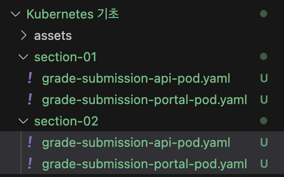
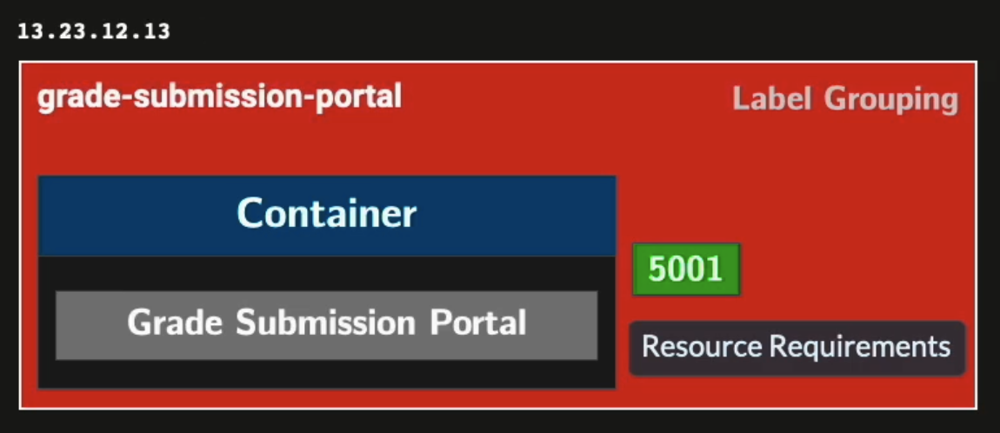
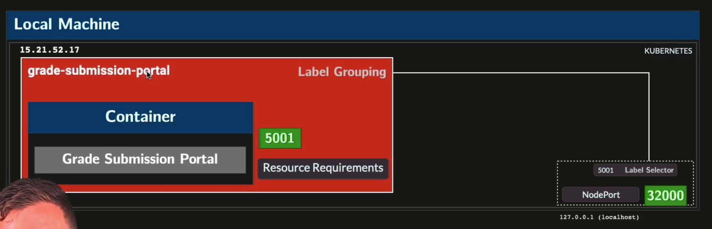
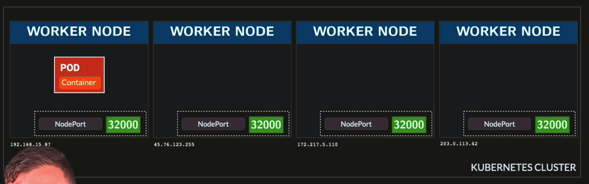
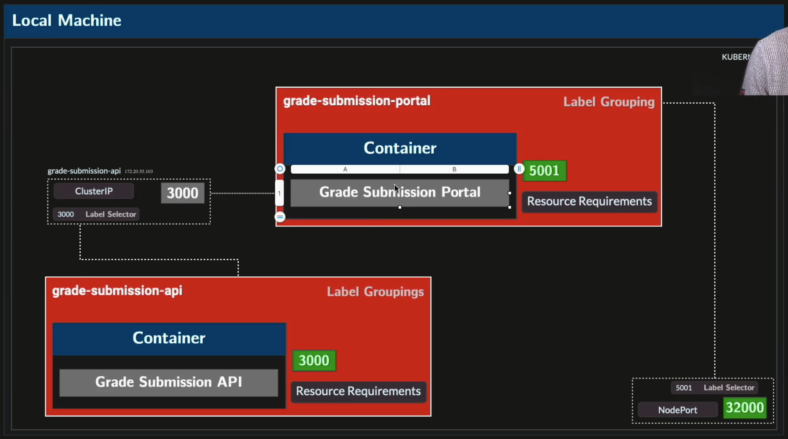
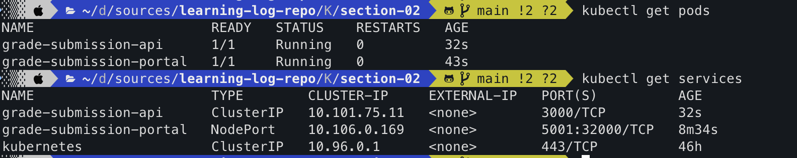
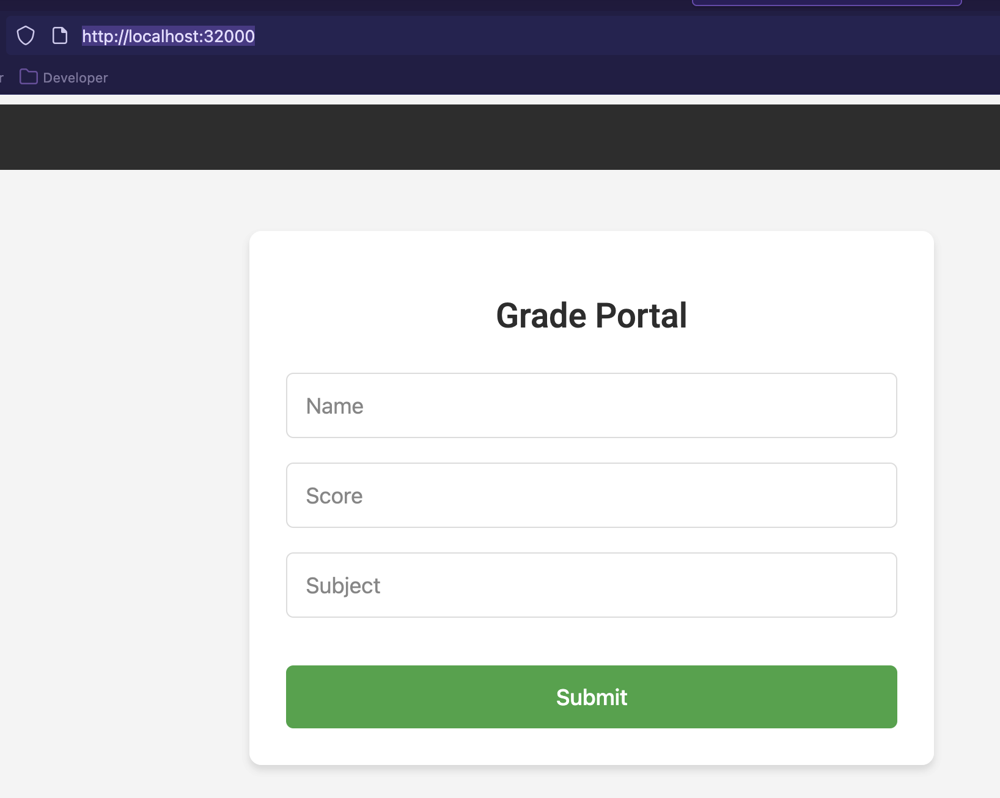
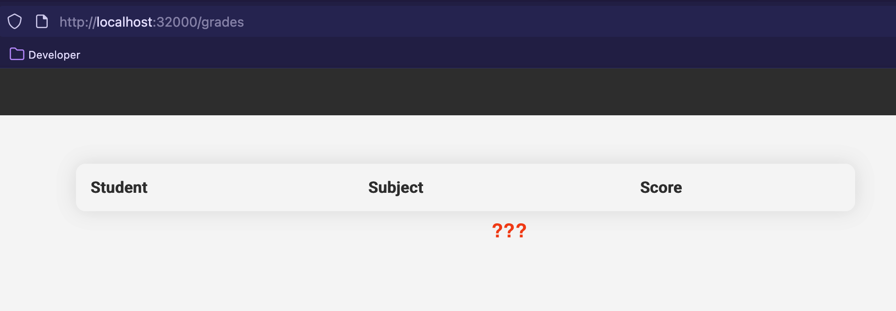

# k8s basic 05 - Service Discovery
#dev/skill/container/k8s

## 강의
[링크](https://www.udemy.com/course/kubernetes-training-learn-kubernetes-from-zero-to-cloud/learn/lecture/44469008#overview)
## 스크립트 요약
### Pod와 IP 주소 문제
* 각 Pod는 **가상 IP**를 부여받음 → IP+포트로 접근 가능.
* 그러나 **Pod는 일시적(ephemeral)** → 생성·삭제 시마다 IP 변경 → **IP로 직접 접근 불가**.
* 따라서 **라벨(Label)** + **셀렉터(Selector)**로 Pod를 찾고, 서비스가 트래픽을 올바른 Pod로 전달.
### NodePort Service
* **외부 접근용 서비스**.
* **노드(로컬 머신)**에 **고정 포트(30,000–32,000)** 열어 외부에서 접근 가능.
* 예: localhost:32000 → NodePort Service → 라벨 셀렉터 → 대상 Pod 포트.
* 단점:
  * 모든 노드에 포트 오픈 → **보안 취약**
  * **확장성 낮음**
  * → **프로덕션에서는 절대 사용 금지**, 프로토타입/로컬 개발에만 사용.
### ClusterIP Service
* **내부 Pod 간 통신용 서비스**.
* 서비스 이름이 자동으로 **DNS로 해석** → Pod 간 안정적 연결 가능.
* 서비스 포트(Service Port) → 라벨 셀렉터로 Pod 선택 → Target Port(컨테이너 포트)로 전달.
* 예: Portal Pod → ClusterIP Service(grade-submission-api:3000) → API Pod:3000.
### 환경 변수와 서비스 연결
* Portal 앱은 **환경 변수(ENV)**를 통해 API URL을 주입받도록 개발됨.
* Pod 정의에서 env 설정:
```yaml
env:
  - name: GRADE_SERVICE_HOST
    value: grade-submission-api
```
* 앱은 이 변수를 이용해 API Service에 요청 → Service가 올바른 Pod로 트래픽 전달.
### 요약 정리
* **Pod 문제**: IP는 **일시적** → 직접 접근 불가.
* **Service**: 안정적인 엔드포인트 제공, **라벨+셀렉터**로 Pod 트래픽 라우팅.
* **NodePort Service**
  * 외부 접근용, 노드 포트(30k~32k) 개방.
  * 보안·확장성 문제 → **프로덕션 금지**.
* **ClusterIP Service**
  * 기본 서비스 유형, 내부 Pod 간 통신 지원.
  * 서비스 이름이 DNS로 자동 해석됨.
* **ENV 변수 활용**
  * Portal Pod이 API Service 이름(grade-submission-api)을 ENV로 받아 API와 연결.
* **차이**
  * NodePort = 외부 접근
  * ClusterIP = 내부 통신

## 실습
### 실습 준비
기존 section-one(01로 바꿨다) 폴더의 yaml을 복사해 section-02로 카피하자. 이제 sidecar 패턴에 대한 학습은 끝났으므로 health-checker 컨테이너 정의는 지웠다. 


```yaml
apiVersion: v1
kind: Pod
metadata:
  name: grade-submission-api
  labels:
    app.kubernetes.io/name: grade-submission
    app.kubernetes.io/component: backend
    app.kubernetes.io/instance: grade-submission-api
spec:
  containers:
  - name: grade-submission-api
    image: rslim087/kubernetes-course-grade-submission-api:stateless-v4
    resources:
      requests:
        memory: "128Mi"
        cpu: "128m"
      limits:
        memory: "128Mi"
    ports:
      - containerPort: 3000
```
```yaml
apiVersion: v1
kind: Pod
metadata:
  name: grade-submission-portal
  labels:
    app.kubernetes.io/name: grade-submission
    app.kubernetes.io/component: frontend
    app.kubernetes.io/instance: grade-submission-portal
spec:
  containers:
  - name: grade-submission-portal
    image: rslim087/kubernetes-course-grade-submission-portal:latest
    resources:
      requests:
        memory: "128Mi"
        cpu: "200m"
      limits:
        memory: "128Mi"
    ports:
      - containerPort: 5001
```

### pod에 접근하기 : NodePort
pod는 IP 주소를 가지고 있다. 하지만 pod는 durable하지 않고, temporary하단 것을 인지하고 있어야 한다. 계속해서 생성되고 파괴되기 때문에 IP로 접근하는 것은 신뢰할 수 있는 방법이 아니다.

`pod`는 클러스터 내부에서만 접근할 수 있다. `kubernetes`는 `pod`에 직접적으로 붙지 않고, `Service`라는 오브젝트를 통해 접근한다. 이러한 `Service`의 유형 중에서 `NodePort`라는 것이 있는데, 클러스터의 모든 `Node`(Worker)의 특정 포트 범위(30000~32767)를 열어준다. 아래 그림에서는 32000 포트로 접근하면, `label selector`를 통해 `grade-submission-portal`이라는 `pod`를 찾고, 해당 `pod`의 5001 포트로 전달되는 것을 표현하고 있다. 현재 그림에서는 1개만 표현하고 있지만 `grade-submission-portal`이라는 label이 명시된 모든 `pod`에 연결할 수 있을 것이다.



다시 말하자면, `NodePort`는 `Kubernetes`에서 외부 트래픽을 `Pod`로 연결하기 위해 `Node`의 특정 포트를 열어주는 방식을 의미한다.



물론 위 그림과 같이 application(container)이 없는 Node까지 포트를 열어둘 필요는 없다. 당연하게도 이런 구성은 보안적으로 취약하다. 

### Service 생성하기
이번엔 `pod`가 아니라, `service`를 만들어보자
> section-02/grade-submission-portal-service.yaml
```yaml
apiVersion: v1
kind: Service
metadata:
  name: grade-submission-portal
spec:
  type: NodePort
  selector:
    app.kubernetes.io/instance: grade-submission-portal
  ports:
  - port: 5001
    targetPort: 5001
    nodePort: 32000
```
`selector`에서 정의하는 것이 `label selector`가 참조할(?) 내용이다. label selector는 해당 이름(label)을 쿼리하고, 해당 pod에 트래픽을 전달할 것이다. 

`type`은 `NodePort`로 정의하고, 포트 정보에서 `targetPort`에는 `pod`의 포트를, `nodePort`에는 `32000`으로 명시한다. `Service` 자체의 포트도 동일하게 `targetPort`와 같은 `5001`로 정의했다.

```sh
kubectl apply -f grade-submission-portal-service.yaml
service/grade-submission-portal created
```
마찬가지로 `kubectl apply`를 이용해 `service`를 생성했다.

이번에는 grade-submission-api-service를 만들어보자.
> section-02/grade-submission-api-service.yaml
```yaml
apiVersion: v1
kind: Service
metadata:
  name: grade-submission-api
spec:
  selector:
    app.kubernetes.io/instance: grade-submission-api
  ports:
  - port: 3000
    targetPort: 3000
```
아래 그림은 현재 구조를 표현하는 구성도이다.



이제 `service`를 포함해, 기존 `pod`를 모두 실행하자.
```sh
kubectl apply -f grade-submission-portal-pod.yaml
...
kubectl apply -f grade-submission-api-pod.yaml
...
kubectl apply -f grade-submission-api-service.yaml
...
```

그리고 `kubectl get services`를 통해 실행중인 `service`를 확인할 수 있다.


이 상태에서 `localhost:32000`으로 접근하면 `portal`에 접속이 가능하다. 우리가 앞서 `NodePort Service`로 열어뒀기 때문이다. 



이제 다음 문제는 `portal`과 `api` 사이의 통신이다. 앞선 학습에서도 이 문제는 해결하지 못한 상태였다. 우리는 그것을 해결하기 위해 `Service`를 선언했다. 하지만 통신 구간에 대한 정의를 했을 뿐 여전히 api 기능을 호출하는 것은 오류가 있다. 왜일까? 

Docker에서도 학습했듯, grade-submission-api를 호출하기 위한 환경변수 값을 설정해야하기 때문이다. 강의 제작자가 제공한 이미지의 [설명](https://hub.docker.com/r/rslim087/grade-submission-portal)을 참고하자. 
> Sets the environment variable `GRADE_SERVICE_HOST` to `node-server`, which is the name of the Grade Submission API container.
그렇다. `GRADE_SERVICE_HOST`라는 이름의 환경변수를 지정해서 grade-submission-api로 통신이 가능하도록 정의해야 한다.

자 그럼 이제 `grade-submission-portal-pod.yaml`에서 환경변수를 명시하자. 13 line의 `env`와 `name`, `value`를 추가했다.
```yaml
apiVersion: v1
kind: Pod
metadata:
  name: grade-submission-portal
  labels:
    app.kubernetes.io/name: grade-submission
    app.kubernetes.io/component: frontend
    app.kubernetes.io/instance: grade-submission-portal
spec:
  containers:
  - name: grade-submission-portal
    image: rslim087/kubernetes-course-grade-submission-portal:latest
    env:
      - name: GRADE_SERVICE_HOST
        value: grade-submission-api
    resources:
      requests:
        memory: "128Mi"
        cpu: "200m"
      limits:
        memory: "128Mi"
    ports:
      - containerPort: 5001
```

### troubleshooting : 거의(?) 불변성
이전과 같이 kubectl apply로 grade-submission-portal-pod를 재배포(?) 하려고 했다. 하지만 여기서 오류 메시지와 함께 실패했다. 
```log
The Pod "grade-submission-portal" is invalid: spec: Forbidden: pod updates may not change fields other than `spec.containers[*].image`,`spec.initContainers[*].image`,`spec.activeDeadlineSeconds`,`spec.tolerations` (only additions to existing tolerations),`spec.terminationGracePeriodSeconds` (allow it to be set to 1 if it was previously negative)
...
```
이를 gpt에 확인하니, `pod`는 `env`와 같은 설정을 건드는 변경은 허용되지 않는다고 한다. 위 에러 메시지에 명시된 것 외에는 실행 중에 바꿀 수 없는 것이다. 그러므로 현재 학습 중에는 기존 `pod`를 `delete`하고, 다시 생성하는 수밖에 없다. 운영에서는 이를 위해 `deployment`로 관리한다고 한다. (일단 현재 학습에선 넘어가자)

```sh
kubectl delete pod grade-submission-portal
pod "grade-submission-portal" deleted
...
kubectl apply -f grade-submission-portal-pod.yaml
pod/grade-submission-portal created
...
```

### 테스트
자 이제 `Service`가 제대로 동작하는지 확인해보자. 먼저 `localhost:32000`로 접근이 가능한지 확인하고, 각 필드를 입력 후 `submit`을 진행했다. 이번에는 **드디어 오류 없이** 화면이 넘어갔다. (물론 db 파드/컨테이너가 없기 때문에 실제로 데이터가 저장되진 않았다) 

(근데 강사는 데이터가 저장된다??? 제공된 이미지가 뭔가 잘못된 것 같지만, 일단 k8s를 관리하는 학습에 집중하자)

