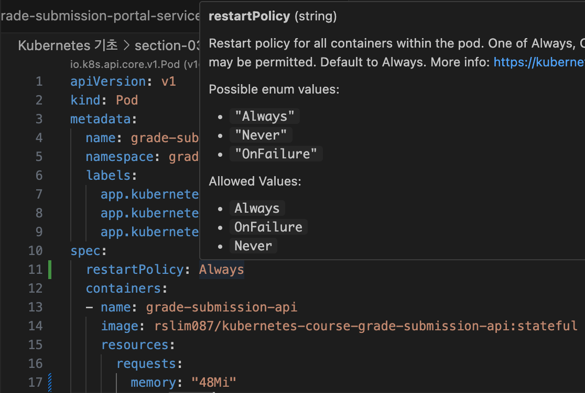
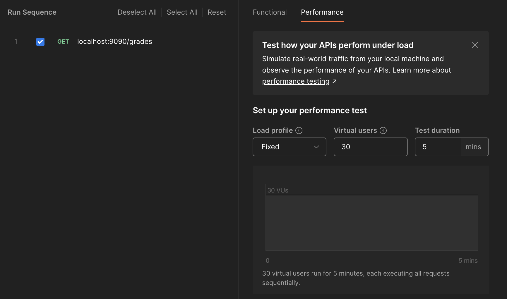
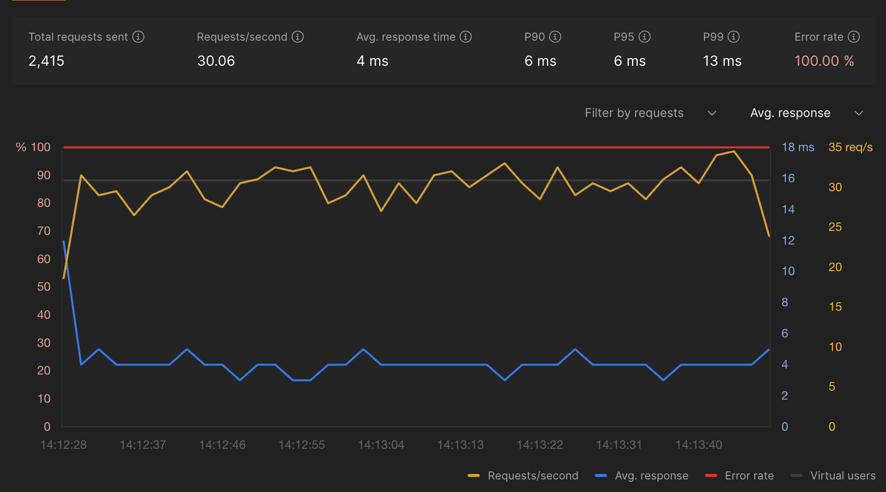
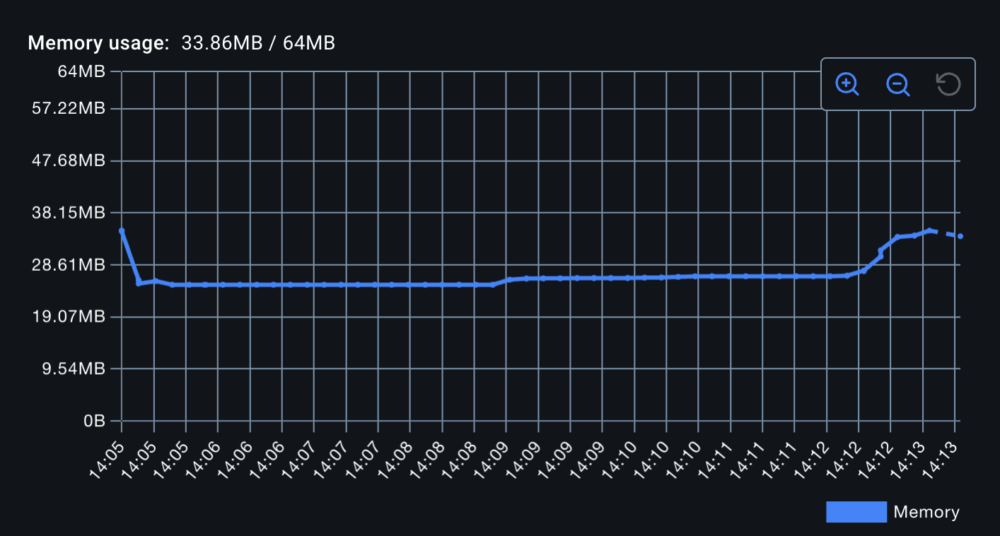
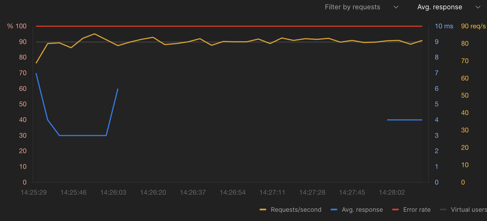
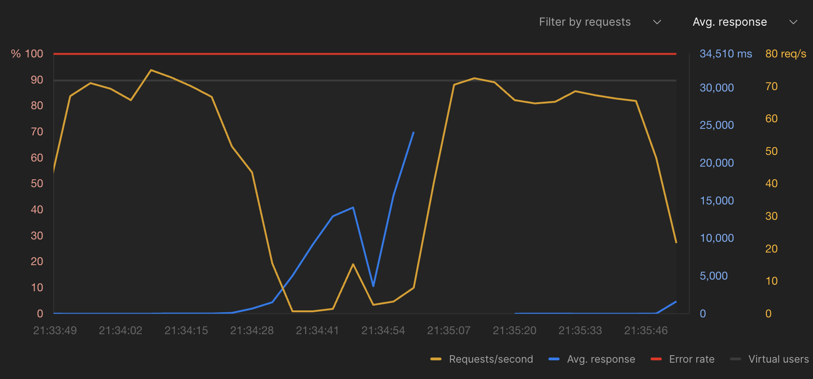

# k8s basic 07 - Resiliency and Self Healing

\#dev/skill/container/k8s

## 스크립트 요약

### 핵심 개념
**자가치유**: 컨테이너가 실패했을 때 쿠버네티스가 자동으로 컨테이너를 재시작하여 애플리케이션을 복구하는 기능

### 기본 재시작 정책 (Restart Policy)
* **기본값**: always (명시적으로 작성할 필요 없음)
* **동작 원리**: 컨테이너 내 프로세스가 종료되면 종료 코드와 관계없이 자동 재시작
* **목적**: 다운타임 최소화 및 애플리케이션 가용성 유지
### 실험 과정
1. 메모리 제한 설정: 35MB로 극도로 낮게 설정
2. 부하 테스트: 25명의 가상 사용자가 10분간 지속적으로 요청 전송 (PostMan runner)
3. OOMKilled 발생: 메모리 한계 초과로 컨테이너 프로세스 종료
4. 자동 재시작: 쿠버네티스가 즉시 컨테이너를 재시작하여 서비스 복구
### 자가치유의 적용 범위
* **메모리 부족 (OOM)**: 메모리 한계 초과
* **애플리케이션 오류**: 프로그래밍 오류로 인한 크래시
* **프로세스 종료**: 어떤 이유든 프로세스가 종료되는 경우
* **모든 종료 코드**: 종료 코드와 관계없이 재시작
### 주요 장점
* **최소 다운타임**: 컨테이너 실패 시 빠른 복구
* **자동 복구**: 수동 개입 없이 애플리케이션 복원
* **지속적 가용성**: 실패 후에도 새로운 요청을 처리할 준비 완료
* **운영 부담 감소**: 시스템이 자동으로 문제를 해결
### 핵심 메시지
쿠버네티스는 컨테이너가 어떤 이유로든 실패하면 자동으로 재시작하여 애플리케이션의 복원력을 보장하며, 이는 프로덕션 환경에서 안정적인 서비스 운영을 가능하게 하는 핵심 기능입니다.

## 실습 과정
이번 장에서는 탄력성(Resiliency)과 자가 치유에 대해 학습한다. 쿠버네티스는 기본적으로 `restartPolicy`가 **Always**로 되어있어, 어떤 이유로 리소스가 종료되면 항상 다시 시작하게 되어있다.

restartPolicy의 기본값은 Always이다.



### 실습하기: 세팅

자 그럼 실제로 pod가 다시 실행될 수 있도록 resources의 limit을 초과하게 만들어보자. 

> 물론 그냥 container를 종료시키기만 해도 kubernetes가 다시 container를 띄우는 것을 눈으로 볼 수 있긴 하다.

#### yaml 변경
먼저, 다음과 같이 api-pod의 `memory`를 **64Mi**로 변경한다. (강의에선 35Mi로 어떻게 한거지?, OOM 오류로 pod가 올라오지도 못한다)
```yaml
apiVersion: v1
kind: Pod
metadata:
  name: grade-submission-api
  namespace: grade-submission
  labels:
    app.kubernetes.io/name: grade-submission
    app.kubernetes.io/component: backend
    app.kubernetes.io/instance: grade-submission-api
spec:
  containers:
  - name: grade-submission-api
    image: rslim087/kubernetes-course-grade-submission-api:stateful
    resources:
      requests:
        memory: "64Mi"
        cpu: "128m"
      limits:
        memory: "64Mi"
    ports:
      - containerPort: 3000
```

다음은 pod와 service를 실행하고,
```sh
kubectl apply -f .
pod/grade-submission-api created
service/grade-submission-api created
pod/grade-submission-portal created
service/grade-submission-portal created

kubectl get pods,services -n grade-submission
NAME                          READY   STATUS    RESTARTS   AGE
pod/grade-submission-api      1/1     Running   0          5s
pod/grade-submission-portal   1/1     Running   0          90s

NAME                              TYPE        CLUSTER-IP       EXTERNAL-IP   PORT(S)          AGE
service/grade-submission-api      ClusterIP   10.109.250.237   <none>        3000/TCP         6m58s
service/grade-submission-portal   NodePort    10.100.233.197   <none>        5001:32000/TCP   6m58s
```

api pod에 접근할 수 있게 잠시 포트 포워딩을 진행한다.
```sh
kubectl port-forward grade-submission-api -n grade-submission 9090:3000
Forwarding from 127.0.0.1:9090 -> 3000
Forwarding from [::1]:9090 -> 3000
```

#### postman 세팅
이제 공격(?)을 위해서 postman을 준비하자.







하지만, 보다시피 이 정도 공격으로는 64MB를 채우지 못했다. 조금 더 많은 트래픽을 보내자.

너무 잘 버텨서 **Memory를 48Mi**로 내리고, **Virtual users를 80**으로 세팅해서 다시 공격(?)해 봤다. 드디어 pod가 내려갔다가 다시 시작했다. 아래 결과를 보면 알 수 있듯, RESTARTS는 1회, 5s 전에 진행되었다.
```sh
kubectl get pods,services -n grade-submission
NAME                          READY   STATUS    RESTARTS     AGE
pod/grade-submission-api      1/1     Running   1 (5s ago)   88s
pod/grade-submission-portal   1/1     Running   0            88s

NAME                              TYPE        CLUSTER-IP       EXTERNAL-IP   PORT(S)          AGE
service/grade-submission-api      ClusterIP   10.109.250.237   <none>        3000/TCP         27m
service/grade-submission-portal   NodePort    10.100.233.197   <none>        5001:32000/TCP   27m
```

하지만 이 테스트의 문제가 하나 있다면 포트 포워딩을 임시로 적용하기 때문에 pod가 다시 올라오는 과정에서 localhost에서 요청하는 연결이 실패한다는 것이다. 아래 그림을 보면 내가 수동으로 port-forward를 다시 하기 전까지 응답이 없다. (통신 실패)



### 실습하기: 세팅 2
자, 그래서 포트 포워딩이 아니라 외부로 공개한 포트로 테스트하기 위해서 api-service의 유형을 NodePort로 바꿔보자. 포트는 31000이다.
```yaml
apiVersion: v1
kind: Service
metadata:
  name: grade-submission-api
  namespace: grade-submission
spec:
  type: NodePort
  selector:
    app.kubernetes.io/instance: grade-submission-api
  ports:
  - port: 3000
    targetPort: 3000
    nodePort: 31000
  # selector:
  #   app.kubernetes.io/instance: grade-submission-api
  # ports:
  # - port: 3000
  #   targetPort: 3000
```

```sh
kubectl delete pod --all -n grade-submission
pod "grade-submission-api" deleted
pod "grade-submission-portal" deleted

kubectl apply -f .
pod/grade-submission-api created
service/grade-submission-api unchanged
pod/grade-submission-portal created
service/grade-submission-portal unchanged

kubectl get pods -n grade-submission
NAME                      READY   STATUS    RESTARTS   AGE
grade-submission-api      1/1     Running   0          20s
grade-submission-portal   1/1     Running   0          20s
```

이제 준비는 끝났다. postman으로 다시 공격을 해보자.

#### postman 공격!
이번에는 `http://localhost:31000/grade`을 호출하는 것으로 수정해 runner를 실행했다. 아래는 지속된 공격(?) 이후 다시 살아난 pod가 다시 응답하기 시작하는 것을 볼 수 있다. 물론 잠깐의 down time은 있지만 자동으로 이루어진 것이다.



실제로 pod의 status가 중간에 `OOMKilled`으로 확인되었고, 잠시 후 다시 pod가 올라왔다. (테스트를 하다가 외부 일정이 있어서 다녀오느라고 6시간 이상 지났다)
```sh
kubectl get pods,services -n grade-submission
NAME                          READY   STATUS      RESTARTS        AGE
pod/grade-submission-api      0/1     OOMKilled   1 (6h51m ago)   6h53m
pod/grade-submission-portal   1/1     Running     1 (6h51m ago)   6h53m

NAME                              TYPE       CLUSTER-IP       EXTERNAL-IP   PORT(S)          AGE
service/grade-submission-api      NodePort   10.109.250.237   <none>        3000:31000/TCP   7h36m
service/grade-submission-portal   NodePort   10.100.233.197   <none>        5001:32000/TCP   7h36m
```
```sh
kubectl get pods,services -n grade-submission
NAME                          READY   STATUS    RESTARTS        AGE
pod/grade-submission-api      1/1     Running   2 (18s ago)     6h53m
pod/grade-submission-portal   1/1     Running   1 (6h51m ago)   6h53m

NAME                              TYPE       CLUSTER-IP       EXTERNAL-IP   PORT(S)          AGE
service/grade-submission-api      NodePort   10.109.250.237   <none>        3000:31000/TCP   7h37m
service/grade-submission-portal   NodePort   10.100.233.197   <none>        5001:32000/TCP   7h37m
```
(잠시 후 다시 살아난 pod/grade-submission-api -> RESTARTS가 2가 되었다)

---

끝 🤓