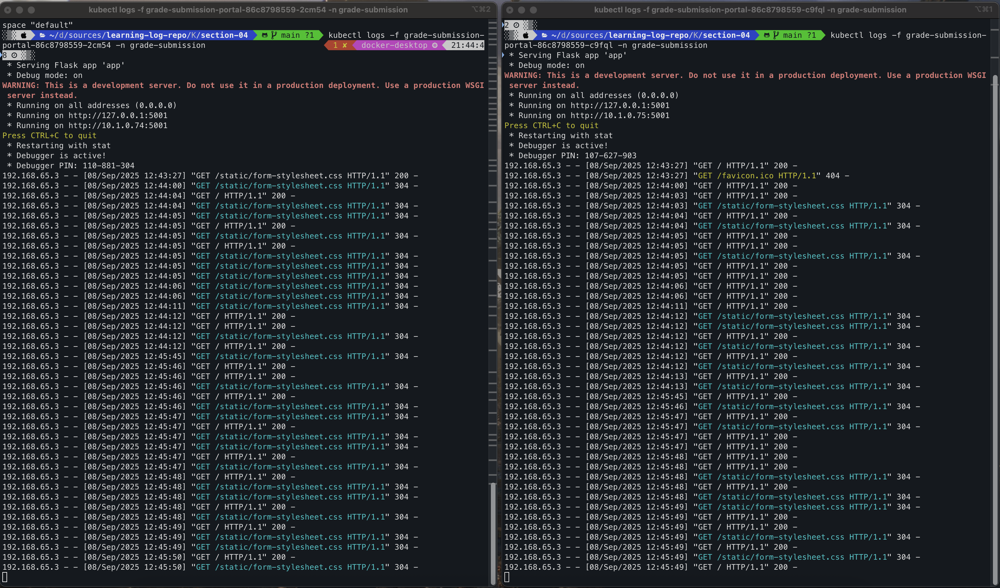

# k8s basic 08 - Deployments and Pod Replicas

\#dev/skill/container/k8s

---
## 스크립트 요약
### 1. Deployment의 필요성
**문제상황**:
* 하나의 Pod으로는 많은 트래픽을 처리하기 어려움
* 앱이 인기가 많아져서 더 많은 인스턴스가 필요한 상황

⠀**해결책**:
* Kubernetes Deployment를 사용하여 Pod 복제본(replica) 관리

### 2. Deployment 작동 원리
#### 기본 구조
```text
Developer → Deployment Object → Kubernetes Magic → 3개의 Pod 복제본
```
#### 내부 동작 과정
1. Deployment 생성 → Deployment Controller 작동
2. ReplicaSet 생성 → 지정된 수의 Pod이 항상 실행되도록 보장
3. ReplicaSet Controller → Pod 템플릿을 기반으로 Pod 생성
#### 핵심 기능
* **자동 Pod 배포**: 지정한 수만큼 Pod 자동 생성
* **지속적 모니터링**: Pod 상태를 지속적으로 감시
* **자동 복구**: Pod가 실패하면 자동으로 새로운 Pod 생성하여 원하는 상태 유지

### 3. 주요 구성 요소
#### Label Selector
* Deployment와 Pod 간의 연결고리
* selector.matchLabels로 관리할 Pod 지정
* Pod 템플릿의 metadata.labels와 일치해야 함
#### Replicas
* 실행하고자 하는 Pod의 개수 지정
* ReplicaSet이 이 숫자를 유지하도록 보장

### 4. 서비스와의 연동
#### 자동 로드 밸런싱
* **ClusterIP Service**가 자연스러운 로드 밸런서 역할
* 여러 Pod에 트래픽을 **라운드 로빈 방식**으로 분산
* 하나의 Pod에 모든 트래픽이 집중되는 것을 방지
#### 트래픽 분산의 이점
* 앱이 과부하로 인해 메모리나 CPU를 과도하게 소비하는 것을 방지
* Pod 종료 위험 감소
* 전체적인 시스템 안정성 향상

### 5. 배포 명령어
```sh
# 기존 Pod 삭제 (standalone pod는 더 이상 사용하지 않음)
kubectl delete pods --all -n grade-submission

# Deployment 적용
kubectl apply -f .

# Deployment 확인
kubectl get deployments -n grade-submission

# Pod 상태 확인
kubectl get pods -n grade-submission
```

### 6. 핵심 원칙
* Standalone Pod 대신 **항상 Deployment를 통해 Pod 관리**
* 하나의 Pod만 필요한 경우에도 Deployment 사용 권장
* Pod가 실패할 경우 자동 복구 기능 제공
### 7. 최종 결과
* **Grade Submission API**: 2개의 Pod 복제본으로 로드 밸런싱
* **Grade Submission Portal**: 1개의 Pod이지만 자동 복구 기능 제공 (실습은 그냥 2개로 함)
* 모든 구성 요소가 같은 네임스페이스에서 원활하게 협력
* 트래픽이 자동으로 분산되어 시스템 안정성 향상

---


## 실습 과정

이번 학습을 위해 section-03의 파일들을 모두 section-04 폴더를 만들어 복사한다.
이제부터는 독립적으로 pod를 실행하지 않고, pod replica를 통해 관리하는 배포를 실습한다. (!!!)

### deployment.yaml 파일 작성: api
다음과 같이 grade-submission-api-deployment.yaml 파일을 생성한다. deployment를 입력하면 자동으로 기본 양식이 완성된다.
> section-04/grade-submission-api-deployment.yaml
```yaml
# deployment 기본 양식
apiVersion: apps/v1
kind: Deployment
metadata:
  name: myapp
spec:
  selector:
    matchLabels:
      app: myapp
  template:
    metadata:
      labels:
        app: myapp
    spec:
      containers:
      - name: myapp
        image: <Image>
        resources:
          limits:
            memory: "128Mi"
            cpu: "500m"
        ports:
        - containerPort: <Port>
```

이후 다음과 같이 내용을 채운다.
```yaml
apiVersion: apps/v1
kind: Deployment
metadata:
  name: grade-submission-api
  namespace: grade-submission
spec:
  replicas: 2
  selector:
    matchLabels:
      app.kubernetes.io/instacne: grade-submission-api
  template:
    metadata:
      labels:
        app.kubernetes.io/name: grade-submission
        app.kubernetes.io/component: backend
        app.kubernetes.io/instance: grade-submission-api
    spec:
      restartPolicy: Always
      containers:
      - name: grade-submission-api
        image: rslim087/kubernetes-course-grade-submission-api:stateful
        resources:
          requests:
            memory: "128Mi"
            cpu: "128m"
          limits:
            memory: "128Mi"
        ports:
          - containerPort: 3000
```

- metadata의 name에 `grade-submission-api`, 그리고 spec의 replicas에는 `2`를 입력한다. 이 수치가 pod replica를 의미한다.
- template 하위의 labels부터 모든 내용은 기존 grade-submission-api-pod.yaml의 내용을 가져와 복사한다. (indentation 주의)
- 그리고 기존 pod.yaml은 이제 필요하지 않기 때문에 삭제한다. 
  - -> `grade-submission-api-deployment.yaml` 파일만 유지

### deployment.yaml 파일 작성: portal
마찬가지로 portal에 대한 deployment.yaml 파일도 작성하자. replica를 2개로 지정하고, 나머지 label 등의 정보를 기존과 같게 맞추었다.
> section-04/grade-submission-portal-deployment.yaml
```yaml
apiVersion: apps/v1
kind: Deployment
metadata:
  name: grade-submission-portal
  namespace: grade-submission
spec:
  replicas: 2
  selector:
    matchLabels:
      app.kubernetes.io/instance: grade-submission-portal
  template:
    metadata:
      labels:
        app.kubernetes.io/name: grade-submission
        app.kubernetes.io/component: frontend
        app.kubernetes.io/instance: grade-submission-portal
    spec:
      containers:
      - name: grade-submission-portal
        image: rslim087/kubernetes-course-grade-submission-portal:latest
        env:
          - name: GRADE_SERVICE_HOST
            value: grade-submission-api
        resources:
          requests:
            memory: "128Mi"
            cpu: "200m"
          limits:
            memory: "128Mi"
        ports:
          - containerPort: 5001
```
이후, 마찬가지로 portal-pod.yaml도 삭제한다.

### deployment 실행
다음과 같이 apply 이후 get pods로 실행된 pod들을 확인하면 각각 2개씩 총 4개가 떠있는 것을 볼 수 있다.
```sh
kubectl apply -f .
...
kubectl get pods,services -n grade-submission
NAME                                           READY   STATUS    RESTARTS   AGE
pod/grade-submission-api-7d97846d8-2pwh7       1/1     Running   0          9s
pod/grade-submission-api-7d97846d8-m9gvc       1/1     Running   0          9s
pod/grade-submission-portal-86c8798559-5ktgf   1/1     Running   0          9s
pod/grade-submission-portal-86c8798559-j6pv8   1/1     Running   0          9s

NAME                              TYPE        CLUSTER-IP      EXTERNAL-IP   PORT(S)          AGE
service/grade-submission-api      ClusterIP   10.100.0.110    <none>        3000/TCP         3m22s
service/grade-submission-portal   NodePort    10.111.79.191   <none>        5001:32000/TCP   3m22s
...
```

### deployment 명령어
또는 다음과 같은 명령어로도 확인할 수 있다.
```sh
kubectl get deployments -n grade-submission
NAME                      READY   UP-TO-DATE   AVAILABLE   AGE
grade-submission-api      2/2     2            2           69s
grade-submission-portal   2/2     2            2           69s
```

deployment 단위로 삭제도 가능하다.
```sh
kubectl delete deployments --all -n grade-submission
deployment.apps "grade-submission-api" deleted
deployment.apps "grade-submission-portal" deleted
```

### Load Balancing

그리고 실제로 2개씩 replica가 존재하고 있는데, 이들은 자동으로 부하 분산이 이루어지고 있다. portal 페이지를 열어 반복적인 새로고침을 수행했는데 다음과 같이 2개의 pod에 번갈아 가며 로그가 출력되고 있었다. nice!



이는 클러스터 IP 서비스가 수행하는 것이라고 하며, 기본적으로 round robin으로 동작한다.

### 자동화된 배포
지금까지의 설정으로 항상 replica 숫자만큼 pod가 유지된다는 것을 알았다. 그렇다면 실제로 pod가 종료되면 어떻게 될까? 자동으로 배포되는지 확인해보자.
```sh
kubectl get pods -n grade-submission
NAME                                       READY   STATUS    RESTARTS   AGE
grade-submission-api-7d97846d8-4ztmk       1/1     Running   0          10m
grade-submission-api-7d97846d8-kd7zh       1/1     Running   0          10m
grade-submission-portal-86c8798559-2cm54   1/1     Running   0          10m
grade-submission-portal-86c8798559-c9fql   1/1     Running   0          10m
```
위 pod 중에서 첫 번째 api-pod인 "grade-submission-api-7d97846d8-4ztmk"를 삭제해보자.
```sh
kubectl delete pod grade-submission-api-7d97846d8-4ztmk -n grade-submission
pod "grade-submission-api-7d97846d8-4ztmk" deleted
```
그리고 직후에 다시 확인해보면 다음과 같은 목록을 확인할 수 있다.
```sh
kubectl get pods -n grade-submission
NAME                                       READY   STATUS        RESTARTS   AGE
grade-submission-api-7d97846d8-4ztmk       1/1     Terminating   0          12m
grade-submission-api-7d97846d8-kd7zh       1/1     Running       0          12m
grade-submission-api-7d97846d8-mdszd       1/1     Running       0          26s
grade-submission-portal-86c8798559-2cm54   1/1     Running       0          12m
grade-submission-portal-86c8798559-c9fql   1/1     Running       0          12m
```
그리고 잠시 후 다시 확인해보면 결국 2개의 pod만 남아있다. replica 개수만큼 유지되고 있는 것이다.
```sh
kubectl get pods -n grade-submission
NAME                                       READY   STATUS    RESTARTS   AGE
grade-submission-api-7d97846d8-kd7zh       1/1     Running   0          12m
grade-submission-api-7d97846d8-mdszd       1/1     Running   0          56s
grade-submission-portal-86c8798559-2cm54   1/1     Running   0          12m
grade-submission-portal-86c8798559-c9fql   1/1     Running   0          12m
```