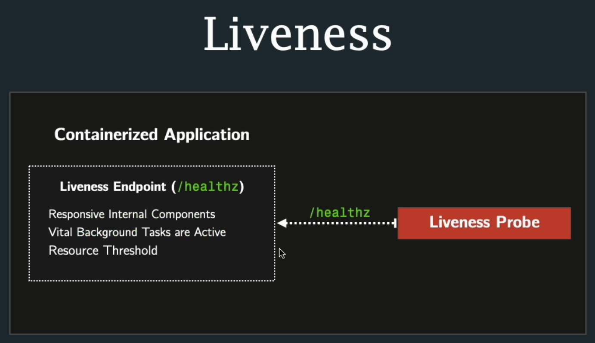
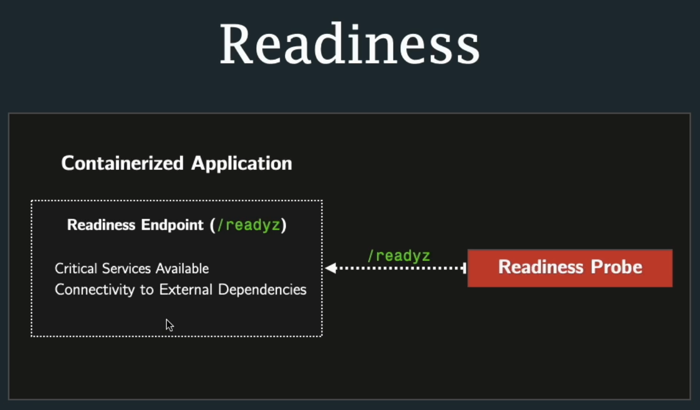

# k8s basic 10 - Liveness & Readiness Probe

\#dev/skill/container/k8s

---

## 스크립트 요약

### 기본 Self-Healing의 한계
* Kubernetes는 **프로세스가 완전히 죽으면** 자동으로 컨테이너 재시작
* **문제**: 프로세스는 살아있지만 앱이 제대로 작동하지 않는 경우는 감지 못함
  * CPU/메모리는 사용 중이지만 실제로는 응답 불가 상태
  * 외부 의존성 문제로 서비스 불가 상태

### Liveness Probe (활성 프로브)
**목적**: 애플리케이션이 정상 작동하는지 확인
**동작 방식**:
* 주기적으로 앱의 health 엔드포인트 체크
* 실패 시 → 컨테이너 자동 재시작
* 앱 내부 컴포넌트 점검:
  * 내부 큐, 캐시
  * 백그라운드 태스크
  * 리소스 임계값 (디스크, 힙 사이즈)
  **설정 예시:**
```yaml
livenessProbe:
  httpGet:
    path: /health
    port: 3000
  initialDelaySeconds: 15  # 앱 시작 대기 시간
  periodSeconds: 5         # 체크 주기
```

### Readiness Probe (준비 프로브)
**목적**: 애플리케이션이 트래픽을 받을 준비가 되었는지 확인
**동작 방식**:
* 주기적으로 readiness 엔드포인트 체크
* 실패 시 → 트래픽 차단 (파드는 실행 중이지만 서비스에서 제외)
* 외부 의존성 점검:
  * 데이터베이스 연결
  * 외부 API
  * 메시지 브로커 (Kafka, RabbitMQ)

**설정 예시**:
```yaml
readinessProbe:
  httpGet:
    path: /ready
    port: 3000
  initialDelaySeconds: 10
  periodSeconds: 5
```

### 중요 포인트
1. InitialDelaySeconds의 중요성
   * Liveness Probe: 필수! 너무 짧으면 앱 시작 전에 재시작 루프 발생
   * Readiness Probe: 선택적 (트래픽만 차단되므로 덜 치명적)
2. 프로브 응답 코드
   * 성공: 200-399
   * 실패: 500 등 (앱이 직접 판단)
3. 실습 관찰 사항
   * Readiness 실패 시: Pod는 Running이지만 0/1 Ready 상태
   * Liveness 실패 시: Pod 자체가 재시작됨

### 개발자 vs 운영자 역할
* **개발자**: health/ready 엔드포인트 구현 (무엇이 "건강한" 상태인지 정의)
* **운영자**: Kubernetes에서 프로브 설정 (언제, 얼마나 자주 체크할지)

⠀**핵심**: Probe를 통해 단순한 프로세스 모니터링을 넘어 **애플리케이션 레벨의 건강 상태**를 모니터링하고 자동으로 복구할 수 있음

---

## 실습 내용
이번 장에서는 애플리케이션이 실행되고 있는지, 요청을 처리할 준비가 되었는지 확인하는 일부 `Probe`에 대해 학습한다.





### 실습 준비
이번에는 section-06 폴더를 생성하고, 마찬가지로 05 폴더의 파일을 모두 복사한다.

그리고 다음과 같이 **api-delpoyment.yaml**을 수정하자.
```yaml
apiVersion: apps/v1
kind: Deployment
metadata:
  name: grade-submission-api
  namespace: grade-submission
spec:
  replicas: 2
  selector:
    matchLabels:
      app.kubernetes.io/instance: grade-submission-api
  strategy:
    type: RollingUpdate
    rollingUpdate: 
      maxUnavailable: 50%
      maxSurge: 1 # 최대 3개의 replicas 실행할 것을 보장
  template:
    metadata:
      labels:
        app.kubernetes.io/name: grade-submission
        app.kubernetes.io/component: backend
        app.kubernetes.io/instance: grade-submission-api
    spec:
      restartPolicy: Always
      containers:
      - name: grade-submission-api
        image: rslim087/kubernetes-course-grade-submission-api:stateless
        livenessProbe: 
          httpGet:
            path: /healthz
            port: 3000
          initialDelaySeconds: 15
          periodSeconds: 5
        readinessProbe:
          httpGet:
            path: /readyz
            port: 3000
          initialDelaySeconds: 10
          periodSeconds: 5
        resources:
          requests:
            memory: "128Mi"
            cpu: "128m"
          limits:
            memory: "128Mi"
        ports:
          - containerPort: 3000

```
다음과 같이 livenessProbe와 readiness 속성을 추가했다.

물론 application에서 사전에 /healthz에 대한 엔드포인트를 구현해야한다.

- initialDelaySeconds: 15 -> 초기 15초 이후에 실행한다.
- periodSeconds: 5 -> 5초마다 실행한다.

같은 내용을 **portal-deployment.yaml**에도 추가하자. 단, 포트는 5001이고, readinessProbe에서 initialDelaySeconds 항목을 제외했다.
```yaml
apiVersion: apps/v1
kind: Deployment
metadata:
  name: grade-submission-portal
  namespace: grade-submission
spec:
  replicas: 2
  selector:
    matchLabels:
      app.kubernetes.io/instance: grade-submission-portal
  template:
    metadata:
      labels:
        app.kubernetes.io/name: grade-submission
        app.kubernetes.io/component: frontend
        app.kubernetes.io/instance: grade-submission-portal
    spec:
      containers:
      - name: grade-submission-portal
        image: rslim087/kubernetes-course-grade-submission-portal:latest
        livenessProbe: 
          httpGet:
            path: /healthz
            port: 5001
          initialDelaySeconds: 15
          periodSeconds: 5
        readinessProbe:
          httpGet:
            path: /readyz
            port: 5001
          periodSeconds: 5
        env:
          - name: GRADE_SERVICE_HOST
            value: grade-submission-api
        resources:
          requests:
            memory: "128Mi"
            cpu: "200m"
          limits:
            memory: "128Mi"
        ports:
          - containerPort: 5001
```

### pod 실행
실습에 앞서 기존 pod는 모두 제거하자.
```sh
kubectl delete deployments --all -n grade-submission
deployment.apps "grade-submission-api" deleted
deployment.apps "grade-submission-portal" deleted
...

kubectl get pods -n grade-submission
No resources found in grade-submission namespace.
```

그리고 다시 section-06 폴더의 내용으로 배포를 진행한다.
```sh
kubectl apply -f .
deployment.apps/grade-submission-api created
service/grade-submission-api unchanged
deployment.apps/grade-submission-portal created
service/grade-submission-portal unchanged
...

kubectl get pods -n grade-submission
NAME                                       READY   STATUS    RESTARTS   AGE
grade-submission-api-756fc8fb-2s2r2        1/1     Running   0          12s
grade-submission-api-756fc8fb-nzqn9        1/1     Running   0          12s
grade-submission-portal-689cc5f956-7vchq   1/1     Running   0          12s
grade-submission-portal-689cc5f956-df224   1/1     Running   0          12s
```
내가 readinessProbe의 초기 지연 시간을 10초로 설정했기 때문에 이미 `READY`가 `1/1`으로 나온다. (...)

다시 delete를 수행하고, 배포 후 **10초 전후**로 조회해보자
```sh
kubectl apply -f .
deployment.apps/grade-submission-api created
service/grade-submission-api unchanged
deployment.apps/grade-submission-portal created
service/grade-submission-portal unchanged
...

kubectl get pods -n grade-submission
NAME                                       READY   STATUS              RESTARTS   AGE
grade-submission-api-756fc8fb-qkgt2        0/1     Running             0          3s
grade-submission-api-756fc8fb-xf9wq        0/1     Running             0          3s
grade-submission-portal-689cc5f956-7pv8g   0/1     ContainerCreating   0          2s
grade-submission-portal-689cc5f956-gkzrl   0/1     ContainerCreating   0          2s
```
먼저 이제 막 시작한 2~3초 상태이다. Running 또는 ContainerCreating 상태를 보이고 있으며, 아직 READY로 올라온 pod는 없다.

```sh
kubectl get pods -n grade-submission
NAME                                       READY   STATUS    RESTARTS   AGE
grade-submission-api-756fc8fb-qkgt2        0/1     Running   0          6s
grade-submission-api-756fc8fb-xf9wq        0/1     Running   0          6s
grade-submission-portal-689cc5f956-7pv8g   0/1     Running   0          5s
grade-submission-portal-689cc5f956-gkzrl   1/1     Running   0          5s
```
약 5~6초 경과한 시점이다. `portal` 중 1개의 `pod`가 먼저 `READY` 상태가 되었다. `portal`의 경우는 **초기 지연 시간**을 정의하지 않았고, **검사 간격**을 5초로 설정했던 만큼 예상했단 결과다.

```sh
kubectl get pods -n grade-submission
NAME                                       READY   STATUS    RESTARTS   AGE
grade-submission-api-756fc8fb-qkgt2        0/1     Running   0          13s
grade-submission-api-756fc8fb-xf9wq        0/1     Running   0          13s
grade-submission-portal-689cc5f956-7pv8g   1/1     Running   0          12s
grade-submission-portal-689cc5f956-gkzrl   1/1     Running   0          12s
```
 약 10초가 초과한 시점, `portal`은 모두 `READY`로 준비되었지만, `api`는 아직 `READY` 상태가 아니다. 초기 지연 시간을 15초로 설정했으니 예상한 결과다.

```sh
kubectl get pods -n grade-submission
NAME                                       READY   STATUS    RESTARTS   AGE
grade-submission-api-756fc8fb-qkgt2        1/1     Running   0          17s
grade-submission-api-756fc8fb-xf9wq        1/1     Running   0          17s
grade-submission-portal-689cc5f956-7pv8g   1/1     Running   0          16s
grade-submission-portal-689cc5f956-gkzrl   1/1     Running   0          16s
```
15초가 지난 시점, `api`까지 모두 `READY`가 되었다.