# k8s basic 11 - StatefulSet & Persistent Volume

\#dev/skill/container/k8s

---

## 스크립트 요약

### 📌 주요 개념
#### 1. Storage Orchestration의 필요성
* **전통적 환경의 문제점**: 운영팀이 각 머신마다 수동으로 스토리지를 프로비저닝하고 애플리케이션과 연결해야 함
* **Kubernetes의 해결책**: Control Plane이 자동으로 스토리지를 관리
#### 2. StatefulSet vs Deployment
|  Deployment (Stateless)   |          StatefulSet (Stateful)          |
| :-----------------------: | :--------------------------------------: |
|   랜덤한 Pod 이름 생성    | 고유한 식별자 (예: mongodb-0, mongodb-1) |
|  Pod들이 상호 교체 가능   |       각 Pod가 고유한 정체성 보유        |
|    순서 없는 스케일링     |         각 Pod마다 전용 스토리지         |
| 공유 또는 무상태 스토리지 |      PVC를 통한 영구 스토리지 연결       |
#### 3. 핵심 컴포넌트
##### **Persistent Volume Claim (PVC)**
* 필요한 스토리지 용량과 특성을 선언
* 각 StatefulSet Pod마다 하나씩 생성됨
* Pod가 재생성되어도 동일한 PVC에 재연결
##### **Persistent Volume (PV)**
* Worker Node 내의 실제 물리적 스토리지
* Kubernetes가 PVC 요구사항에 맞는 PV를 자동으로 찾아 바인딩
##### **Volume Mount**
* 컨테이너 내 특정 경로에 PV를 마운트
* 예: MongoDB의 경우 /data/db
### ⚠️ 중요한 교훈
#### 여러 데이터베이스 복제본의 문제점
* 강의에서 처음 2개의 MongoDB Pod를 배포했을 때 발생한 문제:
  * ClusterIP Service가 요청을 Round-Robin 방식으로 분산
  * 각 데이터베이스가 서로 다른 데이터를 저장
  * 페이지 새로고침 시 불일치하는 데이터 표시
  **해결책**: replicas를 1로 설정하여 단일 데이터베이스만 운영 (강의에서 채택한 방식, replica set 구성은 별도로)
### 🎯 핵심 장점
1. 자동화된 스토리지 관리: 인프라 세부사항을 몰라도 스토리지 요구사항만 정의하면 됨
2. 데이터 영속성: Pod가 삭제되어도 데이터는 PV에 안전하게 보존
3. 자동 재연결: Pod 재생성 시 동일한 이름으로 생성되어 기존 PVC/PV에 자동 연결
4. 확장성: 클라우드 환경에서도 동일한 방식으로 작동
### 📝 실습에서 확인한 사항
* API 컨테이너에 환경변수 전달 (MONGODB_HOST, MONGODB_PORT)
* Readiness Probe로 DB 연결 상태 확인
* Pod 삭제 후 재생성해도 데이터 유지 확인

---


## 실습 내용

### statefulset.yaml 생성
마찬가지로 `section-06`에서 `section-07`로 폴더 위치를 이동하고, 기존 yaml 파일들을 복사한다. 그리고 다음과 같이 `mongodb-statefulset.yaml` 파일을 생성한다. (state만 쳐도 스켈레톤(자동완성)이 된다)
```yaml
apiVersion: apps/v1
kind: StatefulSet
metadata:
  name: mongodb
  namespace: grade-submission
spec:
  selector:
    matchLabels:
      app.kubernetes.io/instance: mongodb
  serviceName: mongodb    ## mongodb-0 mongodb-1 
  replicas: 2
  template:
    metadata:
      labels:
        app.kubernetes.io/name: grade-submission
        app.kubernetes.io/component: database
        app.kubernetes.io/instance: mongodb
    spec:
      containers:
      - name: mongodb
        image: mongo:4.4
        ports:
        - containerPort: 27017
        volumeMounts:
        - name: mongodb-persistent-storage
          mountPath: /data/db
  volumeClaimTemplates:
  - metadata:
      name: mongodb-persistent-storage
    spec:
      accessModes: [ "ReadWriteOnce" ]
      resources:
        requests:
          storage: 1Gi

```
### 실행 및 확인
```sh
kubectl apply -f mongodb-statefulset.yaml
statefulset.apps/mongodb created
...

kubectl get statefulset -n grade-submission
NAME      READY   AGE
mongodb   2/2     16s
...

kubectl get pvc -n grade-submission
NAME                                   STATUS   VOLUME                                     CAPACITY   ACCESS MODES   STORAGECLASS   VOLUMEATTRIBUTESCLASS   AGE
mongodb-persistent-storage-mongodb-0   Bound    pvc-62460272-575f-423f-8c58-4302c524046c   1Gi        RWO            hostpath       <unset>                 2m12s
mongodb-persistent-storage-mongodb-1   Bound    pvc-4d0bb8eb-9336-478f-82c1-a6b10feb46ab   1Gi        RWO            hostpath       <unset>                 2m
...
```
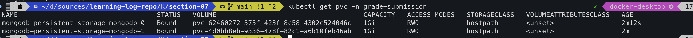

이렇게 하면 다음과 같이 mongodb-0, mongodb-1 2개로 구성되는 것이다. (replicas: 2)

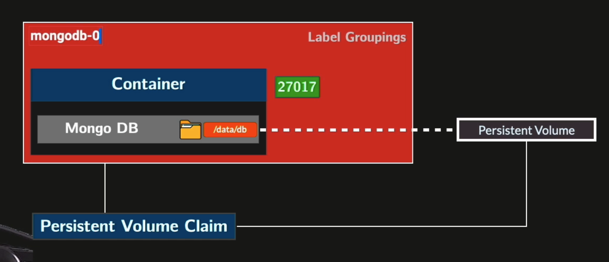

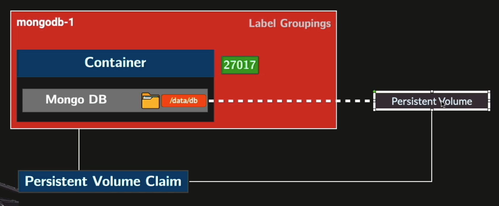

### service.yaml 작성
이제 mongodb를 연결할 `mongodb-service.yaml` 파일을 작성하자 (마찬가지로 kubectl apply로 실행까지)
```yaml
apiVersion: v1
kind: Service
metadata:
  name: mongodb
  namespace: grade-submission
spec:
  selector:
    app.kubernetes.io/instance: mongodb
  ports:
  - port: 27017
    targetPort: 27017

```

### deployment.yaml 수정
그리고, `grade-submission-api`의 이미지를 `stateless-v2`로 변경하고, `mongodb`로 연결을 위한 **환경변수**를 정의한다. (환경변수는 application의 소스코드를 참고하자, 이 강의에서는 예전에(docker 강의에서) 사용했던 애플리케이션이다)

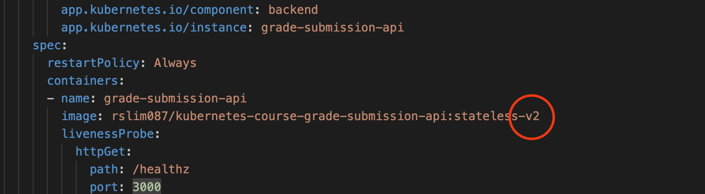

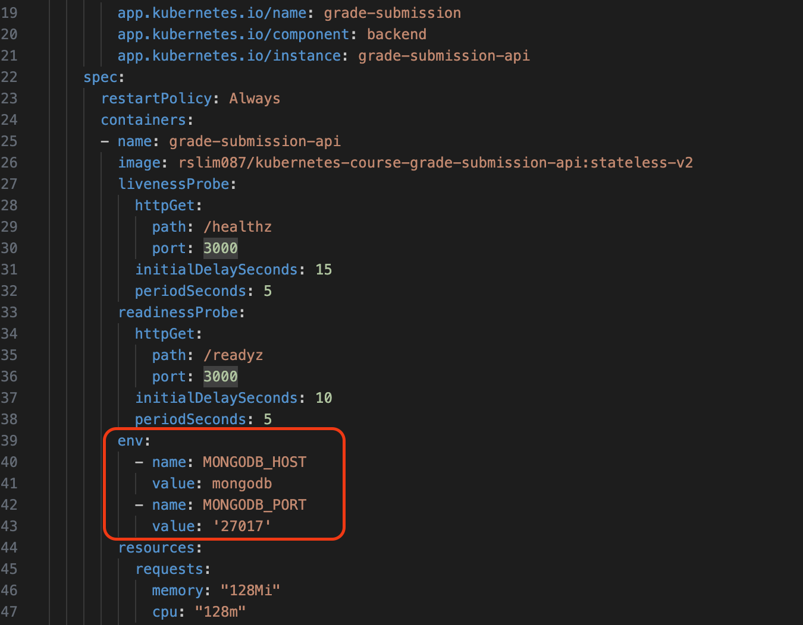

### 실행 및 확인 (2)
이제 deployment까지 실행해보자
```sh
kubectl apply -f .
deployment.apps/grade-submission-api created
service/grade-submission-api unchanged
deployment.apps/grade-submission-portal created
service/grade-submission-portal unchanged
service/mongodb unchanged
statefulset.apps/mongodb configured
...

kubectl get pods -n grade-submission
NAME                                       READY   STATUS    RESTARTS   AGE
grade-submission-api-5c479cf8fd-ngp2k      1/1     Running   0          33s
grade-submission-api-5c479cf8fd-rnbpv      1/1     Running   0          33s
grade-submission-portal-689cc5f956-7vdtp   1/1     Running   0          33s
grade-submission-portal-689cc5f956-mlms4   1/1     Running   0          33s
mongodb-0                                  1/1     Running   0          15m
mongodb-1                                  1/1     Running   0          15m
...
```

그리고 docker desktop을 통해 grade-submission-api의 로그를 확인해보면 MongoDB에 연결한 것을 확인할 수 있다.

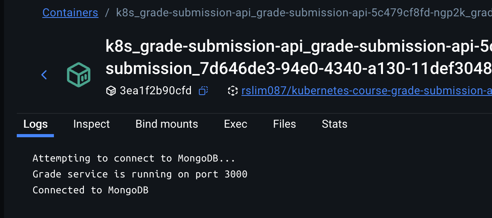

### 차이점
deployment로 실행된 pod들을 보면 **이름이 무작위**로 생성되었다. 어차피 쿠버네티스가 서비스 검색을 통해 알아서 pod를 찾고 통신한다. 이는 확장성을 고려해 stateless하게 구성했기 때문이다. 여러 대의 pod가 늘어나고 줄어드는 과정에서 정상적으로 통신할 수 있어야 하기 때문이다. 
그러나 statefulset의 경우는 다르다. 위의 mongodb pod에서 볼 수 있듯, 'mongodb-0', 'mongodb-1'이라는 **고정된 이름의 형태**로 생성되었다. 그리고 **PVC(persistent volume claim)**로 연결되어 자신의 고유한(고정된?) storage에 접근할 수 있다.

> 자, 그럼 이대로 괜찮을까?

### 테스트
실행된 grade-submission-portal에 접속해보자. (localhost:32000)에서 데이터를 입력하며 테스트를 하다보면 데이터가 양쪽에 저장되는 현상을 볼 수 있다.

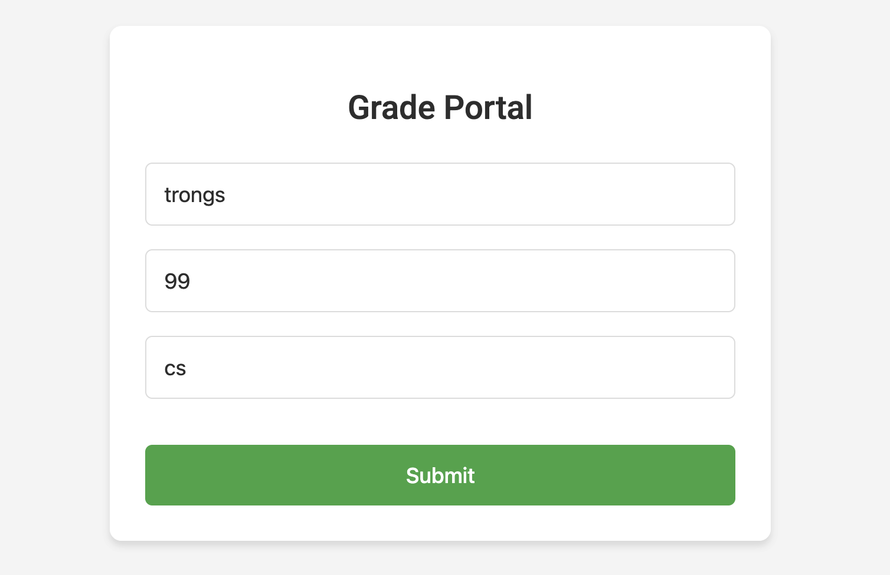

mongodb-0
```sh
mongo test --eval "db.grades.find().pretty()"
MongoDB shell version v4.4.29
connecting to: mongodb://127.0.0.1:27017/test?compressors=disabled&gssapiServiceName=mongodb
Implicit session: session { "id" : UUID("a7614d69-6da6-4be8-9e8b-62e51c622f3e") }
MongoDB server version: 4.4.29
{
        "_id" : ObjectId("68ecdc0084a22928385d1ca4"),
        "name" : "trongs",
        "subject" : "cs",
        "score" : 99,
        "__v" : 0
}
{
        "_id" : ObjectId("68ecdc0884a22928385d1caa"),
        "name" : "trongs",
        "subject" : "cs",
        "score" : 99,
        "__v" : 0
}
```

mongodb-1
```sh
mongo test --eval "db.grades.find().pretty()"
MongoDB shell version v4.4.29
connecting to: mongodb://127.0.0.1:27017/test?compressors=disabled&gssapiServiceName=mongodb
Implicit session: session { "id" : UUID("6a2506a8-85b4-484a-9522-685762648a95") }
MongoDB server version: 4.4.29
{
        "_id" : ObjectId("68ecdc06d4cc29d6bae8a65a"),
        "name" : "trongs",
        "subject" : "cs",
        "score" : 99,
        "__v" : 0
}
```
총 3건의 데이터를 저장했는데, 이처럼 mongodb-0과 mongodb-1에 각각 2건, 1건씩 저장되었다. 실제로 front에서도 2건 또는 1건이 번갈아 나온다.

**statefulset.yaml 수정**

이를 해결하려면 replicas를 2가 아닌 1로 변경해서, 하나의 mongodb에만 붙을 수 있게 하면 된다.

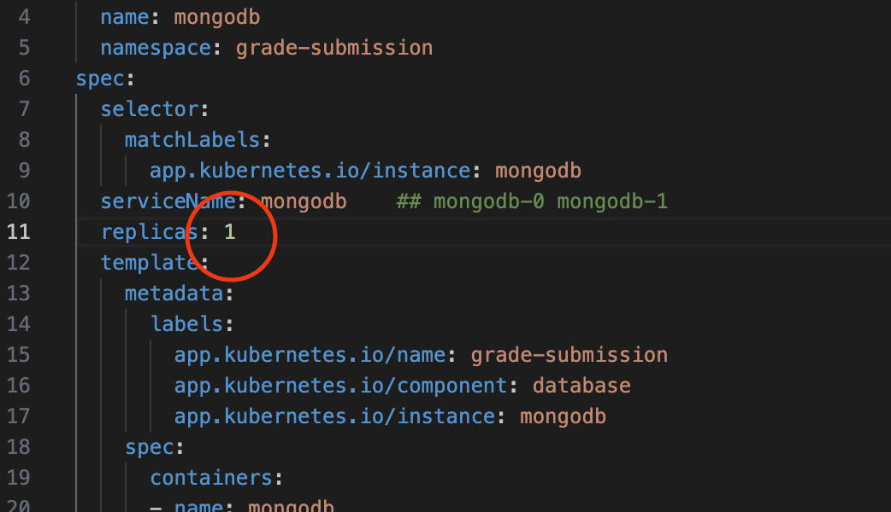


---
## 의문점
일단 강의 내용은 여기까지 였는데... 그렇다면 db와 같은 상태를 가져야 하는 리소스는 replicas를 활용할 수 없는 것일까?

### 구성 변경
지금부터 이를 해결하기 위해 `claude code`와 함께 진행한다. (~~강의에 없으니까~~)

`claude`는 다음과 같이 3가지 단계를 제시했다.
> ⏺ 현재 구성을 확인했습니다. MongoDB Replica Set을 제대로 구성하려면 다음 단계들이 필요합니다:
> MongoDB Replica Set 구성 방법
> 1. MongoDB를 --replSet 옵션으로 시작
> 2. Headless Service 구성 (Pod간 직접 통신)
> 3. Replica Set 초기화

먼저 `mongodb-statefulset.yaml` 파일을 다음과 같이 수정한다.

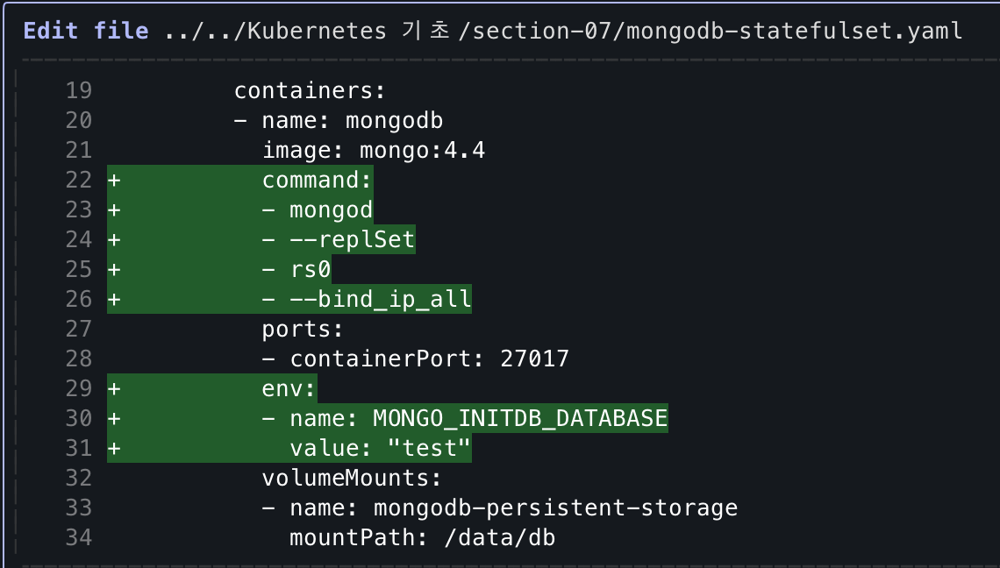

그리고 `mongodb-service.yaml` 파일을 수정해 Headless 서비스로 바꾼다.

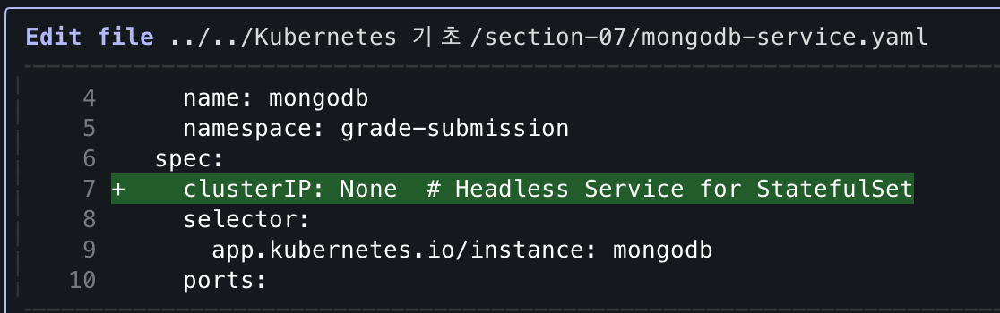

마지막으로 `mongodb-statefulset.yaml` 파일에서 다시 `replicas: 2`로 변경한다.

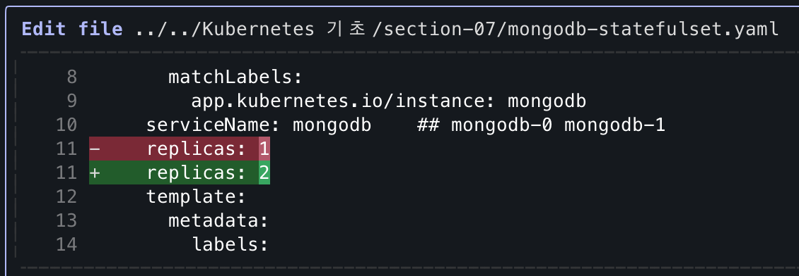

다음은 초기화 스크립트를 생성하며, 이는 `ConfigMap`으로 구성한다. 
> mongodb-init-configmap.yaml
```yaml
apiVersion: v1
kind: ConfigMap
metadata:
  name: mongodb-init-script
  namespace: grade-submission
data:
  init-replicaset.sh: |
    #!/bin/bash
    # Wait for MongoDB to be ready
    until mongosh --eval "print(\"MongoDB is ready\")"; do
      echo "Waiting for MongoDB to start..."
      sleep 2
    done

    # Check if replica set is already initialized
    RS_STATUS=$(mongosh --quiet --eval "rs.status().ok")

    if [ "$RS_STATUS" != "1" ]; then
      echo "Initializing replica set..."
      mongosh --eval '
      rs.initiate({
        _id: "rs0",
        members: [
          { _id: 0, host: "mongodb-0.mongodb.grade-submission.svc.cluster.local:27017" },
          { _id: 1, host: "mongodb-1.mongodb.grade-submission.svc.cluster.local:27017" }
        ]
      })'
      echo "Replica set initialized!"
    else
      echo "Replica set already initialized."
    fi

```

구성은 끝났다. 이제 다시 statefulset을 제거하고 다시 실행하면 된다. 
```sh
kubectl delete service mongodb -n grade-submission
kubectl delete statefulset mongodb -n grade-submission
...
kubectl apply -f mongodb-service.yaml
kubectl apply -f mongodb-statefulset.yaml
...
```

이후 status를 확인해보면 다음과 같이 PRIMARY, SECONDARY로 구성된 것을 확인할 수 있다.
```sh
mongo --eval "rs.status().members.forEach(m => print(m.name + ' - ' + m.stateStr))"
MongoDB shell version v4.4.29
connecting to: mongodb://127.0.0.1:27017/?compressors=disabled&gssapiServiceName=mongodb
Implicit session: session { "id" : UUID("cea7e578-7080-4318-9920-f907576682cd") }
MongoDB server version: 4.4.29
mongodb-0.mongodb.grade-submission.svc.cluster.local:27017 - PRIMARY
mongodb-1.mongodb.grade-submission.svc.cluster.local:27017 - SECONDARY
```

이후 `claude code`를 통해 몇 가지 검증 과정을 거쳤다.
> ⏺ 완벽합니다! MongoDB Replica Set이 제대로 구성되었습니다.
>
> 구성 완료 요약
>
> 변경 사항:
> 1. mongodb-statefulset.yaml: /Users/trongs/dev/sources/learning-log-repo/Kubernetes 기초/section-07/mongodb-statefulset.yaml:22-26
>    - --replSet rs0 옵션으로 Replica Set 활성화
>    - --bind_ip_all로 모든 네트워크 인터페이스에서 연결 허용
> 2. mongodb-service.yaml: /Users/trongs/dev/sources/learning-log-repo/Kubernetes 기초/section-07/mongodb-service.yaml:7
>    - clusterIP: None으로 Headless Service 구성
>    - Pod 간 직접 통신 가능 (StatefulSet DNS: mongodb-0.mongodb.grade-submission.svc.cluster.local)
> 3. Replica Set 초기화
>    - PRIMARY: mongodb-0
>    - SECONDARY: mongodb-1
>
>   검증 결과:
>   mongodb-0 (PRIMARY)와 mongodb-1 (SECONDARY) 모두 동일한 3개의 레코드 보유:
> - trongs, cs, 99 (2개)
> - replica-test, kubernetes, 100 (1개)
>
>   이제 PRIMARY에 데이터를 쓰면 자동으로 SECONDARY에 복제됩니다!
>
> 참고:
> - SECONDARY에서 읽기를 하려면 rs.secondaryOk() 또는 rs.slaveOk() 명령이 필요합니다
> - 애플리케이션 연결 시 connection string:
>   mongodb://mongodb-0.mongodb.grade-submission.svc.cluster.local:27017,mongodb-1.mongodb.grade-submission.svc.cluster.local:27017/test?replicaSet=rs0

### 트러블슈팅
이제 3개의 데이터가 확실하게 동기화된 것은 맞다. replica set 설정은 성공이다. 
그런데 front에서는 여전히 통합된 3건이 나오거나, 아예 0건이 나오는 상황이 발생하고 있다. 왜일까?

원인은 grade-submission-api의 mongodb 연결 문자열이다. 
> mongodb:27017

이 경우 Headless Service이므로 라운드 로빈 방식으로 mongodb-0(primary)과 mongodb-1(secondary) 사이를 번갈아 연결할 것이다. 그러나 문제는 `PRIMARY`로만 쓰기가 가능하며, `SECONDARY`로는 기본적으로 읽기도 불가능하다는 점이다. 그래서 라운드 로빈에 의해 `SECONDARY`로 연결될 때마다 front에서는 0건의 데이터가 조회되었던 것이다.  
> 위의 참고 내용을 보면 "SECONDARY에서 읽기를 하려면 rs.secondaryOk() 또는 rs.slaveOk() 명령이 필요"하다고 명시되어있다.

#### 해결 방안
그래서 애초에 연결 문자열을 변경해야하나 싶었다가, 현재 강의에서 제공되는 application에서는 정해진 환경변수(`MONGODB_HOST`, `MONGODB_PORT`)를 사용할 것이기에, 이는 유지하고, `SECONDARY`에서도 읽을 수 있도록 변경하는 방안을 채택했다. 

(아래는 claude code가 제안한 연결 문자열 변경을 거절한 내용이다)

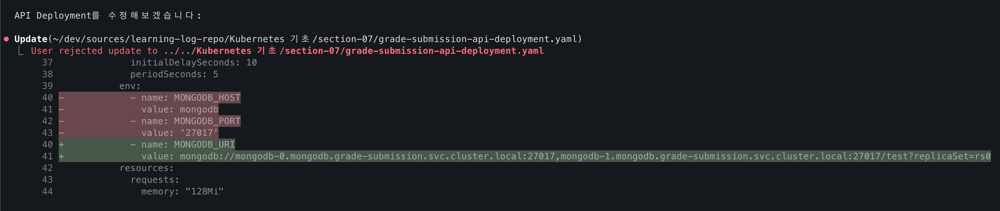

그러나 이 내용도 권장되지 않았다. `claude`에 따르면 이는 MongoDB 쉘 세션에서만 적용되는 설정이므로 영구적이지 않다는 것이다.
> `SECONDARY`에서 읽기를 하려면 rs.secondaryOk() 또는 rs.slaveOk() 명령이 필요합니다

또한 실무적인 관점에서, 이와 같은 기능의 경우엔 `PRIMARY`에서만 읽는 게 맞다는 판단이다. 그러므로 grade-submission-api가 `PRIMARY`만 보도록 설정한다. 

먼저,  `mongodb-service.yaml` 파일에 다음과 같이 반영한다.

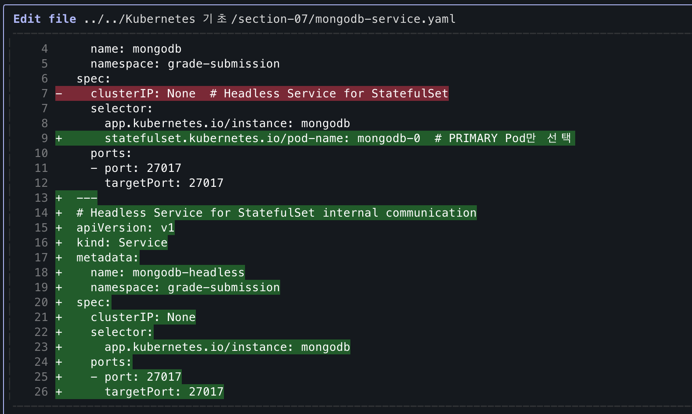

그리고 `mongodb-statefulset.yaml` 파일을 다음과 같이 수정해서, 이제 `mongodb-headless` 서비스를 바라보도록 한다.

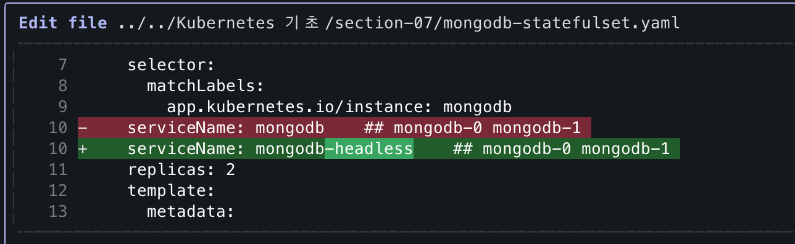

ConfigMap 파일인 `mongodb-init-configmap.yaml` 파일도 마찬가지로 다음과 같이 수정한다.

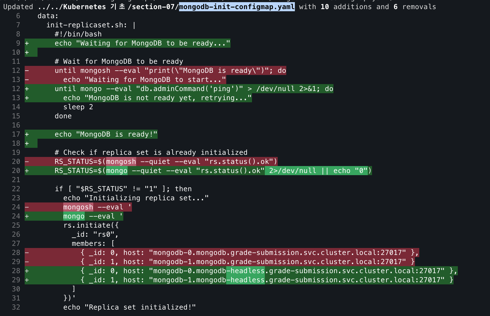

그리고 다시 `mongodb-statefulset.yaml`을 수정해 ConfigMap을 마운트하고 replica set 초기화 스크립트를 실행하도록 설정한다.

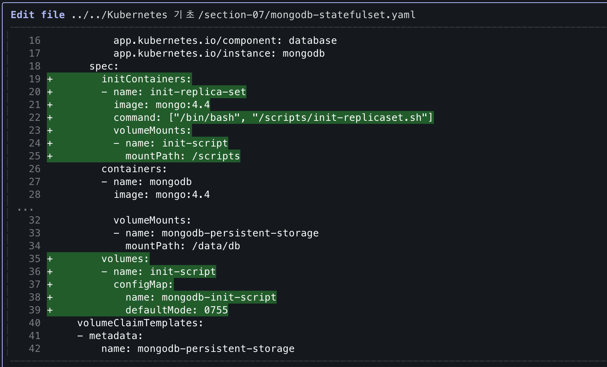

#### 다시 테스트
자 이제 다시 확인할 시간이다. 모든 리소스를 제거하고 다시 구축해보자.
```sh
kubectl delete deployments,services,statefulset,pvc --all -n grade-submission
deployment.apps "grade-submission-api" deleted
deployment.apps "grade-submission-portal" deleted
service "grade-submission-api" deleted
service "grade-submission-portal" deleted
service "mongodb" deleted
service "mongodb-headless" deleted
statefulset.apps "mongodb" deleted
persistentvolumeclaim "mongodb-persistent-storage-mongodb-0" deleted
persistentvolumeclaim "mongodb-persistent-storage-mongodb-1" deleted
...

kubectl get pods,services,statefulset -n grade-submission
No resources found in grade-submission namespace.
```

```sh
kubectl apply -f .
deployment.apps/grade-submission-api created
service/grade-submission-api created
deployment.apps/grade-submission-portal created
service/grade-submission-portal created
configmap/mongodb-init-script created
service/mongodb created
service/mongodb-headless created
statefulset.apps/mongodb created
...

kubectl get pods,services,statefulset -n grade-submission
NAME                                           READY   STATUS     RESTARTS   AGE
pod/grade-submission-api-5c479cf8fd-bh9q8      0/1     Running    0          28s
pod/grade-submission-api-5c479cf8fd-g7z6m      0/1     Running    0          28s
pod/grade-submission-portal-689cc5f956-btsnc   1/1     Running    0          28s
pod/grade-submission-portal-689cc5f956-gj6p5   1/1     Running    0          28s
pod/mongodb-0                                  0/1     Init:0/1   0          28s

NAME                              TYPE        CLUSTER-IP       EXTERNAL-IP   PORT(S)          AGE
service/grade-submission-api      ClusterIP   10.104.234.52    <none>        3000/TCP         29s
service/grade-submission-portal   NodePort    10.111.232.205   <none>        5001:32000/TCP   28s
service/mongodb                   ClusterIP   10.102.138.199   <none>        27017/TCP        28s
service/mongodb-headless          ClusterIP   None             <none>        27017/TCP        28s

NAME                       READY   AGE
statefulset.apps/mongodb   0/2     28s
```

그러나 문제가 또 있다. 보다시피 mongodb-0이 Init:0/1 상태로 계속 유지되고 있는데, 이는 Init Container에서 Mongo DB에 연결하려고 하는데 아직 MongoDB 컨테이너가 시작되지 않았고, Init Container는 메인 컨테이너보다 먼저 실행되기 때문에 준비되지 못하는 상태가 유지되는 것이다.
이를 해결하고자 다시 `mongodb-statefulset.yaml` 파일을 수정하는데, 여기서는 `postStart hook` 기법을 적용한다. 

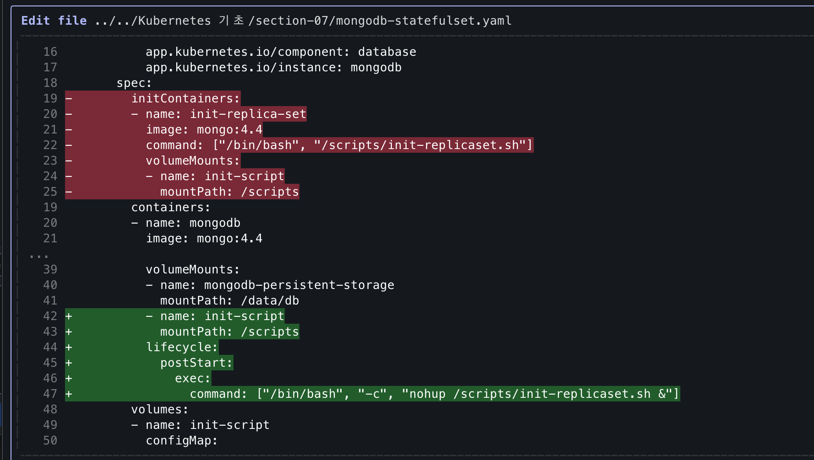

다시 테스트!
```sh
kubectl delete deployments,services,statefulset,pvc --all -n grade-submission
...

kubectl apply -f .
...

kubectl get pods,services,statefulset -n grade-submission
NAME                                           READY   STATUS              RESTARTS   AGE
pod/grade-submission-api-5c479cf8fd-fgrlp      0/1     Running             0          7s
pod/grade-submission-api-5c479cf8fd-mr98s      0/1     Running             0          7s
pod/grade-submission-portal-689cc5f956-85bqd   1/1     Running             0          7s
pod/grade-submission-portal-689cc5f956-96bqd   1/1     Running             0          7s
pod/mongodb-0                                  1/1     Running             0          7s
pod/mongodb-1                                  0/1     ContainerCreating   0          3s

NAME                              TYPE        CLUSTER-IP       EXTERNAL-IP   PORT(S)          AGE
service/grade-submission-api      ClusterIP   10.108.35.77     <none>        3000/TCP         7s
service/grade-submission-portal   NodePort    10.103.238.158   <none>        5001:32000/TCP   7s
service/mongodb                   ClusterIP   10.98.224.76     <none>        27017/TCP        7s
service/mongodb-headless          ClusterIP   None             <none>        27017/TCP        7s

NAME                       READY   AGE
statefulset.apps/mongodb   1/2     7s
```

이번에는 초기화(Init) 단계를 잘 넘어간 것으로 보인다. 최종적으로 모든 리소스가 올라왔다!

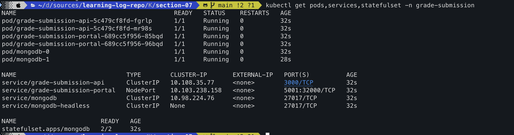
