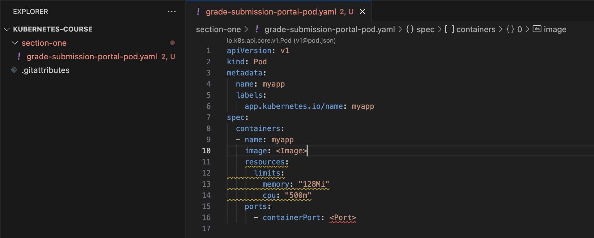
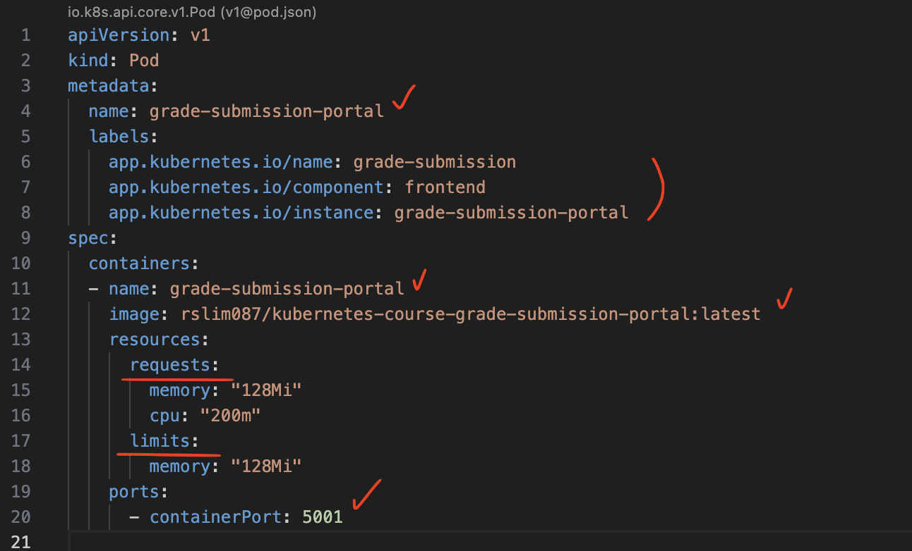
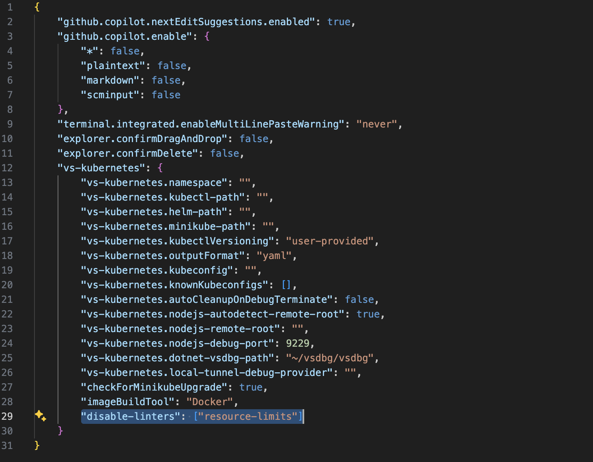
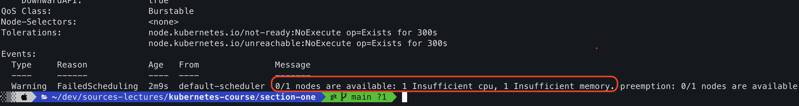
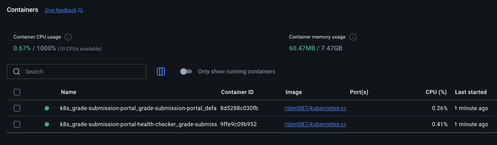

# k8s basic 03 - Pod & Container
#dev/skill/container/k8s

## 강의
[온라인 강의 - 자신의 일정에 맞춰 뭐든지 배워보세요](https://www.udemy.com/course/kubernetes-training-learn-kubernetes-from-zero-to-cloud/learn/lecture/44369034?start=0#overview)

## 스크립트 요약
---
### 1. Kubernetes 기본 개념
* **Kubernetes**: 여러 대의 머신(노드) 위에서 동작하는 컨테이너 오케스트레이션 도구.
  * **Master Node**: 스케줄링 및 관리 담당.
  * **Worker Node**: 실제 애플리케이션 실행, CPU·메모리 제공.
* 클러스터 전체가 협력하여 클라우드 네이티브 앱을 안정적으로 실행·배포 가능.
### 2. 클라우드 네이티브 애플리케이션
* **정의**: 여러 **마이크로서비스(Microservice)**로 분리, 각각 컨테이너 안에서 실행.
* **특징**: 독립 기능 수행, 컨테이너를 통한 **이식성** 확보.
* **예시**: 전자상거래 앱 → 주문, 상품 카탈로그, 재고, 결제 등 개별 마이크로서비스.
### 3. 컨테이너와 Pod
* **컨테이너**: 앱 + 의존성만 포함, 환경에 상관없이 동일하게 실행 가능.
* **Pod**: Kubernetes의 **최소 배포 단위**, 컨테이너는 반드시 Pod 안에서 실행됨.
  * Pod는 메타데이터(이름, 라벨) + 런타임 요구사항(이미지, 포트, 리소스)으로 정의.
  * 일반적으로 **Pod 1개 ↔ 컨테이너 1개 ↔ 마이크로서비스 1개** 관계.
### 4. 라벨(Label)과 셀렉터
* Pod에 **라벨(label)** 부여 → 논리적 그룹화.
* 예시:
  * app.kubernetes.io/name: 애플리케이션 이름
  * app.kubernetes.io/component: 역할(frontend / backend)
  * app.kubernetes.io/instance: 특정 인스턴스 구분
* 활용: kubectl delete -l app=... / kubectl scale -l component=frontend
### 5. 리소스 관리
* **Requests**: 최소 보장 CPU·메모리.
* **Limits**:
  * 메모리(memory): **비압축성 자원**, 초과 사용 방지를 위해 반드시 제한 필요.
  * CPU: **압축성 자원**, 보통 제한하지 않음(스케줄러가 자동 throttling).
* 적절한 값은 **부하 테스트(load test)**로 결정.
### 6. Pod 실행 과정
1 Pod 정의(YAML) 작성 → kubectl apply -f
2 실행 상태 확인 → kubectl get pods, kubectl describe pod
3 로그 확인 → kubectl logs (-f 옵션으로 실시간 스트리밍)
4 외부 접근 → kubectl port-forward (클러스터 내부 포트 ↔ 로컬 포트 연결)
### 7. Pod 내 다중 컨테이너
* 일반적으로 Pod 1개당 컨테이너 1개.
* 예외: **사이드카(Sidecar) 패턴**
  * 메인 컨테이너(마이크로서비스) + 보조 컨테이너(예: 헬스체커, 로깅, 모니터링).
  * 동일 Pod 내에서 실행되어 **네트워크·라이프사이클 공유** (localhost 통신 가능).
### 8. 실습 예제
* **Grade Submission App**
  * **Portal(Frontend)**: 사용자 입력받는 UI.
  * **API(Backend)**: 제출 데이터 저장 로직.
  * Portal Pod + API Pod → 최종적으로 전체 서비스 구성.
* Portal Pod에 **Health Checker(sidecar)** 컨테이너 추가하여 상태 확인.

### 핵심 키워드
Kubernetes, Master/Worker Node, Cloud Native App, Microservice, Container, Pod, Label, Resource Requests/Limits, Port-forward, Sidecar Pattern, Health Checker

---
## 실습 (1)
### 첫 번째 pod 생성
먼저 루트에서 'section-one' 폴더를 만들고 시작하자. `grade-submission-portal-pod.yaml` 파일을 생성한다. 그리고 'pod'만 입력해도 자동으로 다음과 같은 포맷을 완성시킬 수 있다. (vscode kubernetest 확장프로그램 설치 필요)
```yaml
apiVersion: v1
kind: Pod
metadata:
  name: myapp
  labels:
    app.kubernetes.io/name: myapp
spec:
  containers:
  - name: myapp
    image: <Image>
    resources:
      limits:
        memory: "128Mi"
        cpu: "500m"
    ports:
      - containerPort: <Port>
```


보다시피, 기본적으로 pod와 컨테이너화된 마이크로서비스 사이에는 1:1 관계가 있다. 

일단 `pod.yaml` 파일을 다음과 같이 수정하자. 
```yaml
apiVersion: v1
kind: Pod
metadata:
  name: grade-submission-portal
  labels:
    app.kubernetes.io/name: grade-submission
    app.kubernetes.io/component: frontend
    app.kubernetes.io/instance: grade-submission-portal
spec:
  containers:
  - name: grade-submission-portal
    image: rslim087/kubernetes-course-grade-submission-portal:latest
    resources:
      requests:
        memory: "128Mi"
        cpu: "200m"
      limits:
        memory: "128Mi"
    ports:
      - containerPort: 5001
```


- `labels`에서 app.kubernetes.io로 네임스페이스(?)를 구분하고, `name`, `component`, `instance`를 명시했다. 이 `label`들은 추후 작업 명령(쿼리)에 활용된다. `metadata`의 `name`과 `containers`의 `name`은 같은 이름 `grade-submission-portal`을 명시했다. 

- `containers`에 쓰인 `image`는 강의 제작자가 제공한 것을 이용했다. (다운로드가 매우 느리다)
```sh
docker pull rslim087/kubernetes-course-grade-submission-portal:latest
docker pull rslim087/kubernetes-course-grade-submission-api:stateless-v4
```

- `limits`로 표현되어있던 부분을 `requests`/`limits` 2가지로 나누고, 각각의 사양을 정의하자. `CPU`는 조절되나, `memory`는 그렇지 않기 때문에 `OutOfMemory` 문제가 발생하지 않도록, 일반적으로는 `memory`만 `limits`를 작성한다고 한다. (이때 lint 경고가 계속 발생하는데 `settings.json`에서 "vs-kubernetes"를 입력하면 자동으로 설정이 완성되며, 하위에 "disable-linters": ["resource-limits"]를 추가하자)


### pod 실행하기
자 이제 작성한 pod.yaml을 기반으로 pod를 실행하자. yaml 파일이 있는 section-one 폴더로 이동한 뒤 다음 명령어를 실행하자.
```sh
kubectl apply -f grade-submission-portal-pod.yaml
pod/grade-submission-portal created
...

kubectl get pods
NAME                      READY   STATUS    RESTARTS   AGE
grade-submission-portal   1/1     Running   0          12s
...

kubectl describe pod grade-submission-portal
Name:             grade-submission-portal
Namespace:        default
Priority:         0
Service Account:  default
Node:             docker-desktop/192.168.65.3
Start Time:       Wed, 03 Sep 2025 16:47:49 +0900
Labels:           app.kubernetes.io/component=frontend
                  app.kubernetes.io/instance=grade-submission-portal
                  app.kubernetes.io/name=grade-submission
Annotations:      <none>
Status:           Running
IP:               10.1.0.17

...

Events:
  Type    Reason     Age   From               Message
  ----    ------     ----  ----               -------
  Normal  Scheduled  97s   default-scheduler  Successfully assigned default/grade-submission-portal to docker-desktop
  Normal  Pulling    97s   kubelet            Pulling image "rslim087/kubernetes-course-grade-submission-portal:latest"
  Normal  Pulled     95s   kubelet            Successfully pulled image "rslim087/kubernetes-course-grade-submission-portal:latest" in 1.968s (1.968s including waiting). Image size: 54111651 bytes.
  Normal  Created    95s   kubelet            Created container: grade-submission-portal
  Normal  Started    95s   kubelet            Started container grade-submission-portal
...
```

`kubectl apply`를 통해 리소스(pod)를 생성했다. 이후 `kubectl get pods`, `kubectl describe pod`로 `pod`의 실행 상태를 확인했다. 그러나 해당 `pod`가 실질적으로 잘 동작하고 있는지 확인할 방법이 없다. 우리는 이 `pod`에 접근할 수 없기 때문이다. 그러므로 `포트 포워딩`을 통해 로컬에서 접근해보자.

### port forwarding
다음 명령으로 포트 포워딩을 설정하고 로컬에서 실행된 `pod`에 접근해보자.
```sh
kubectl port-forward grade-submission-portal 8080:5001
Forwarding from 127.0.0.1:8080 -> 5001
Forwarding from [::1]:8080 -> 5001
...
Handling connection for 8080
Handling connection for 8080
...
```

이후 `localhost:8080`으로 정상 접근되었다. (물론 submit 기능에서 오류가 있지만)


## 실습 (2)
### pod 삭제하기
이번엔 `pod`를 삭제하자. `label`에 입력했던 정보를 이용한다.
```sh
kubectl delete pod -l "app.kubernetes.io/name=grade-submission"
pod "grade-submission-portal" deleted
...
kubectl get pods
No resources found in default namespace.
...
```

### 다시 pod 생성하기 (초과 사양)
이번에는 `memory`와 `cpu`를 과도하게 높여서 `pod`를 생성하자. 과연 어떻게 될까?
```yaml
apiVersion: v1
kind: Pod
metadata:
  name: grade-submission-portal
  labels:
    app.kubernetes.io/name: grade-submission
    app.kubernetes.io/component: frontend
    app.kubernetes.io/instance: grade-submission-portal
spec:
  containers:
  - name: grade-submission-portal
    image: rslim087/kubernetes-course-grade-submission-portal:latest
    resources:
      requests:
        memory: "100000Mi"
        cpu: "50000"
      limits:
        memory: "100000Mi"
    ports:
      - containerPort: 5001
```
위처럼 `yaml`을 수정하고, `kubectl apply`를 실행하자.
```sh
kubectl apply -f grade-submission-portal-pod.yaml
pod/grade-submission-portal created
...
kubectl get pods
NAME                      READY   STATUS    RESTARTS   AGE
grade-submission-portal   0/1     Pending   0          35s
...
```
`get pods` 결과를 보니 아직 생성되지 않고 `Pending` 상태이다. 
> kubernetes는 이러한 리소스를 제공할 수 있는 노드가 있는지 찾고있다. (있을 리가...)

`kubectl describe pod` 결과


이제 이 의미없는 `pod`를 다시 삭제하자. 아까보다 간단하게 그냥 `name`을 기준으로 삭제할 수 있다.
```sh
kubectl delete pod grade-submission-portal
pod "grade-submission-portal" deleted
...
```

## 실습 (3)
이번에는 `health checker` 컨테이너를 추가로 포함해서, 총 2개의 컨테이너를 하나의 `pod` 내에 띄워보자. 아래 그림에 따르면 `Health Check`는 `Portal`에 의존하고 있으며, 해당 `container`가 없이 존재할 수 없다.

이번에도 강사가 제공하는 `docker hub` 이미지를 가져와서 실습한다.

```sh
docker pull rslim087/kubernetes-course-grade-submission-portal-health-checker
```

### pod yaml 수정
`Health Checker` 컨테이너를 추가로 띄우기 위해서 `pod.yaml`을 수정하자.
> section-one/grade-submission-portal-pod.yaml
```yaml
apiVersion: v1
kind: Pod
metadata:
  name: grade-submission-portal
  labels:
    app.kubernetes.io/name: grade-submission
    app.kubernetes.io/component: frontend
    app.kubernetes.io/instance: grade-submission-portal
spec:
  containers:
  - name: grade-submission-portal
    image: rslim087/kubernetes-course-grade-submission-portal:latest
    resources:
      requests:
        memory: "128Mi"
        cpu: "200m"
      limits:
        memory: "128Mi"
    ports:
      - containerPort: 5001
  - name: grade-submission-portal-health-checker
    image: rslim087/kubernetes-course-grade-submission-portal-health-checker:latest
    resources:
      requests:
        memory: "128Mi"
        cpu: "200m"
      limits:
        memory: "128Mi"
```

그리고 다시 `kubectl apply`로 `pod`를 생성하자. 결과와 같이 2개의 컨테이너가 뜬 것을 볼 수 있다.
```sh
kubectl apply -f grade-submission-portal-pod.yaml
kubectl get pods
NAME                      READY   STATUS    RESTARTS   AGE
grade-submission-portal   2/2     Running   0          10s
...
```


### 로그 확인하기
이제 실제로 health check가 잘 동작하고 있는지 확인하자. 
```sh
kubectl logs -f grade-submission-portal -c grade-submission-portal
...
127.0.0.1 - - [03/Sep/2025 08:39:00] "GET /healthz HTTP/1.1" 200 -
127.0.0.1 - - [03/Sep/2025 08:39:05] "GET /healthz HTTP/1.1" 200 -
127.0.0.1 - - [03/Sep/2025 08:39:10] "GET /healthz HTTP/1.1" 200 -
127.0.0.1 - - [03/Sep/2025 08:39:15] "GET /healthz HTTP/1.1" 200 -
127.0.0.1 - - [03/Sep/2025 08:39:20] "GET /healthz HTTP/1.1" 200 -
...
```
```sh
kubectl logs -f grade-submission-portal -c grade-submission-portal-health-checker
...
Grade Submission Portal - Health Check Sidecar
Monitoring application health...

╭──────────────────────────────────────────────╮
│ Application is healthy! Response Time: 0.00s │
╰──────────────────────────────────────────────╯
Grade Submission Portal - Health Check Sidecar
Monitoring application health...

╭──────────────────────────────────────────────╮
│ Application is healthy! Response Time: 0.00s │
╰──────────────────────────────────────────────╯
Grade Submission Portal - Health Check Sidecar
Monitoring application health...

╭──────────────────────────────────────────────╮
│ Application is healthy! Response Time: 0.00s │
╰──────────────────────────────────────────────╯
...
```

## 정리
- `pod`의 상세 스펙을 정의하기 위한 `yaml` 작성 방법을 학습했다.
- `kubectl` 기본 명령어로 `pod`를 실행하고, 조사, 로그 확인, 삭제하는 방법을 학습했다.
- `sidecar` 패턴: 동일 pod내에서 메인 컨테이너를 보조하는 **보조 컨테이너** 추가 방법을 학습했다.
