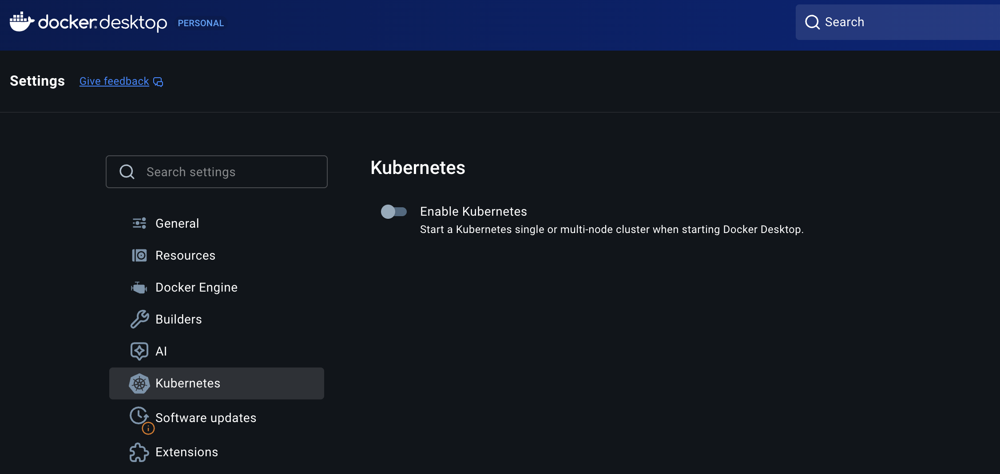
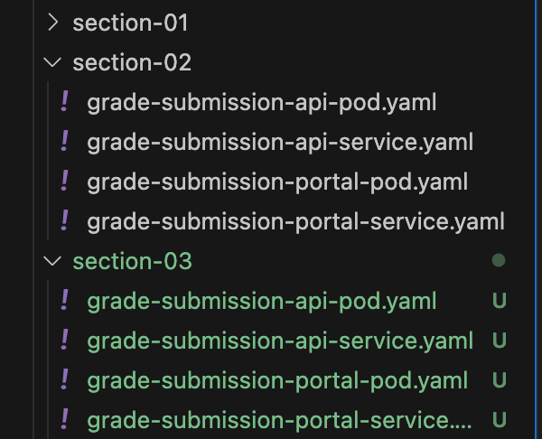

# k8s basic 06 - Namespace

\#dev/skill/container/k8s

## 강의

[링크](https://www.udemy.com/course/kubernetes-training-learn-kubernetes-from-zero-to-cloud/learn/lecture/44482822?persist_locale=&locale=en_US#overview)

## 스크립트 요약

### **네임스페이스란?**

- **정의**: 클러스터 내에서 관련 리소스들을 논리적으로 그룹핑하는 경계
- **특성**: 물리적 구조가 아닌 논리적 구조로, 실제 메모리나 CPU를 소모하지 않음
- **목적**: etcd 데이터베이스가 생성하는 보이지 않는 경계선으로 리소스 관리를 용이하게 함

### **쿠버네티스 클러스터의 추상화**

- **물리적 구조**: 마스터 노드들과 워커 노드들로 구성된 여러 머신들
- **개발자 경험**: kubectl을 통해 하나의 통합된 쿠버네티스 엔터티로 인식
- **논리적 분할**: 물리적 머신들이 네임스페이스라는 논리적 경계로 나뉘어 보임

### **네임스페이스의 활용 예시**

- **grade-submission**: 성적 제출 관련 모든 리소스
- **freescale**: API 게이트웨이 관련 리소스
- **logging**: Elasticsearch, Logstash, Kibana 등
- **monitoring**: Prometheus, Grafana 등

### **네임스페이스의 주요 장점**

- 역할 기반 접근 제어 (RBAC)
  - 사용자 역할에 따라 특정 네임스페이스에만 접근 권한 부여
  - 기업 환경에서 보안성 향상
- 리소스 할당량 제한
  - 네임스페이스별로 메모리, CPU 등 리소스 사용량 제한 가능

### **기본 네임스페이스들**

- **default**: 기본 워크로드들
- **kube-system**: 쿠버네티스 핵심 시스템 컴포넌트들
- **ingress-nginx**: Ingress 관련 리소스들

### **실습 내용**

1. 기본적으로 모든 리소스는 default 네임스페이스에 배포됨
2. kubectl create namespace grade-submission으로 새 네임스페이스 생성
3. 두 가지 배포 방법:
   - 명령어에서 -n 플래그로 네임스페이스 지정
   - YAML 파일의 metadata에 namespace 직접 명시 (권장)

### **핵심 포인트**

네임스페이스는 복잡한 물리적 클러스터를 논리적으로 단순화하여 개발자가 관련 리소스들을 효율적으로 관리할 수 있게 해주는 쿠버네티스의 핵심 추상화 개념입니다.

---


## 정리 & 실습

### namespace



이번 장에선 namespace에 대해 학습한다. namespace는 물리적인 공간이 아닌 논리적인 구성이며 리소스(메모리, cpu)를 소비하지 않는다. 덕분에 우리는 관련된 리소스들을(pod 등) 쉽게 관리할 수 있다.

우리가 회사에서 일한다고 가정하자. 쿠버네티스 클러스터에 접근하기 위한 자격 증명이 요구될 것이며 권한에 따라 정해진 namespace만 접근할 수 있을 것이다.

### **세팅**

**section-03** 폴더를 만들고, section-02에 있던 모든 파일들을 복사한다.



### 실습하기: CLI
아직 pod들을 실행하지 않은 상태이다. `kubectl get namespaces` 명령으로 기본 생성되어있던 namespace를 확인한다.
```sh
kubectl get namespaces
NAME              STATUS   AGE
default           Active   2d18h
kube-node-lease   Active   2d18h
kube-public       Active   2d18h
kube-system       Active   2d18h
...
```

이제 다시 kubectl apply를 이용해 pod들을 실행해보자
```sh
kubectl apply -f grade-submission-api-pod.yaml
kubectl apply -f grade-submission-portal-pod.yaml
...
```

이후 kubectl get pods를 이용해 namespace = default인 pod들을 쿼리해보자
```sh
kubectl get pods -n default
NAME                      READY   STATUS    RESTARTS   AGE
grade-submission-api      1/1     Running   0          47s
grade-submission-portal   1/1     Running   0          38s
...
```

자 이제, 우리는 default가 아닌, grade-submission이라는 새로운 namespace로 지정하고 싶다. 실행 중인 pod를 삭제하고 다시 진행해보자.
```sh
kubectl delete pods --all -n default
pod "grade-submission-api" deleted
pod "grade-submission-portal" deleted
...

kubectl create namespace grade-submission
namespace/grade-submission created
...
kubectl get namespaces
NAME               STATUS   AGE
default            Active   2d18h
grade-submission   Active   7s
kube-node-lease    Active   2d18h
kube-public        Active   2d18h
kube-system        Active   2d18h
```
`kubectl create namespace` 명령을 통해 namespace를 새로 생성했다.

그리고 pod들을 다시 실행하는데, namespace를 지정해보자.
```sh
kubectl apply -f . -n grade-submission
pod/grade-submission-api created
service/grade-submission-api created
pod/grade-submission-portal created
```

#### trouble shooting (1)
그런데 하나 문제가 생겼다. 32000 포트를 이미 사용하고 있던 Service(node port) 때문이다.
```sh
The Service "grade-submission-portal" is invalid: spec.ports[0].nodePort: Invalid value: 32000: provided port is already allocated
```

해당 Service를 삭제하고 다시 진행하자.
```sh
kubectl delete service grade-submission-portal -n default
service "grade-submission-portal" deleted
...

kubectl apply -f . -n grade-submission
pod/grade-submission-api unchanged
service/grade-submission-api unchanged
pod/grade-submission-portal unchanged
service/grade-submission-portal created
...
```
이제야 제대로 실행되었다. 


### 실습하기: YAML

앞선 내용처럼 `kubectl` 명령어를 통해 namespace를 지정해도 되지만, 가능하다면 애초에 구성 파일(.yaml)에서 정의하는 것이 더 관리하기 용이할 것이다. 이번에는 이 방법으로 진행하자.

아래는 `grade-submission-portal-service.yaml` 파일이다. 나머지 파일도 모두 동일하게 `metadata.namspace`를 "grade-submission"으로 지정했다.
```yaml
apiVersion: v1
kind: Service
metadata:
  name: grade-submission-portal
  namespace: grade-submission
spec:
  type: NodePort
  selector:
    app.kubernetes.io/instance: grade-submission-portal
  ports:
  - port: 5001
    targetPort: 5001
    nodePort: 32000
```

자, 다시 모든 pod와 service를 삭제하고 다시 실행하자.
```sh
kubectl delete pods,services --all -n grade-submission
pod "grade-submission-api" deleted
pod "grade-submission-portal" deleted
service "grade-submission-api" deleted
service "grade-submission-portal" deleted
...
```

그리고 더 이상 -n (namespace) 옵션 없이도 구성 파일(.yaml)을 통해 namespace가 지정된 것을 확인할 수 있다.
```sh
kubectl apply -f .
pod/grade-submission-api created
service/grade-submission-api created
pod/grade-submission-portal created
service/grade-submission-portal created
...

kubectl get pods,services -n grade-submission
NAME                          READY   STATUS    RESTARTS   AGE
pod/grade-submission-api      1/1     Running   0          57s
pod/grade-submission-portal   1/1     Running   0          57s

NAME                              TYPE        CLUSTER-IP      EXTERNAL-IP   PORT(S)          AGE
service/grade-submission-api      ClusterIP   10.103.141.73   <none>        3000/TCP         57s
service/grade-submission-portal   NodePort    10.103.89.221   <none>        5001:32000/TCP   57s
...
```

---
끝 👏